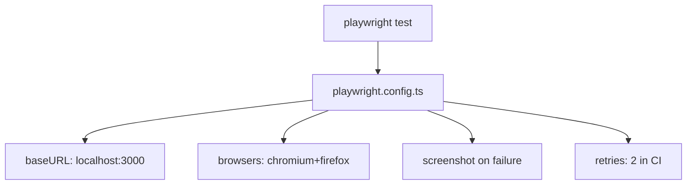

# PRD: Community 347 — UI Playwright Test Configuration

## Master Goal Mapping
**Goal:** Configure Playwright E2E test runner for ALDECI aldeci-ui-new, defining base URLs, browser targets, screenshot paths, and CI retry policies for robust UI testing.

**Domain:** Frontend Testing / Configuration
**Personas:** Platform Engineer, QA Engineer
**Node Count:** 1 | **Status:** Implemented

---

## Source Files
- `suite-ui/aldeci-ui-new/playwright.config.ts`

## Graph Nodes (Labels)
- playwright.config.ts

---

## Architecture Diagram



---

## Code Proof

- `suite-ui/aldeci-ui-new/playwright.config.ts:L1` — Playwright configuration for ALDECI UI E2E tests

---

## Inter-Dependencies

- `suite-ui/aldeci-ui-new/e2e/`
- `serve.js`
- `@playwright/test`

### Community Link Dependencies
- No external community dependencies

---

## Data Flow

```
playwright test → config → browser launch → baseURL → test execution → artifacts
```

---

## Referenced Docs

- `Playwright docs`
- `suite-ui/aldeci-ui-new/e2e/real-world-persona-flows.spec.ts`

---

## Acceptance Criteria

- [ ] Config loads without errors
- [ ] Chromium + Firefox configured
- [ ] CI retries = 2, local = 0

---

## Effort Estimate

**0.5 day (Trivial — isolated leaf module)**

---

## Status

**Implemented** — Module exists in codebase. Integration tests recommended.
