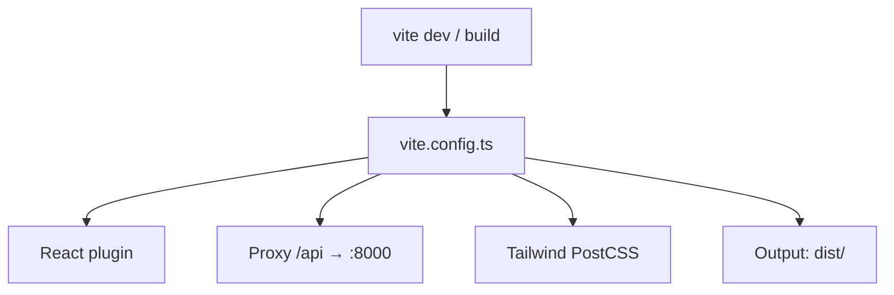

# PRD: Community 348 — UI Vite Build Configuration

## Master Goal Mapping
**Goal:** Configure Vite 6 build system for aldeci-ui-new React 19 app, defining dev server proxy to FastAPI backend, build output paths, and Tailwind v4 PostCSS integration.

**Domain:** Frontend / Build System
**Personas:** Frontend Developer, Platform Engineer
**Node Count:** 1 | **Status:** Implemented

---

## Source Files
- `suite-ui/aldeci-ui-new/vite.config.ts`

## Graph Nodes (Labels)
- vite.config.ts

---

## Architecture Diagram



---

## Code Proof

- `suite-ui/aldeci-ui-new/vite.config.ts:L1` — Vite 6 configuration for React 19 + Tailwind v4 build

---

## Inter-Dependencies

- `suite-ui/aldeci-ui-new/src/`
- `suite-api/apps/main.py (proxy target)`
- `@vitejs/plugin-react`

### Community Link Dependencies
- No external community dependencies

---

## Data Flow

```
src/ → Vite transform → React JSX → bundle → dist/ (prod) / HMR (dev)
```

---

## Referenced Docs

- `Vite docs`
- `suite-ui/aldeci-ui-new/package.json`
- `Tailwind v4 docs`

---

## Acceptance Criteria

- [ ] `npm run build` produces dist/ without errors
- [ ] Dev proxy /api → backend works
- [ ] HMR works for .tsx changes

---

## Effort Estimate

**0.5 day (Trivial — isolated leaf module)**

---

## Status

**Implemented** — Module exists in codebase. Integration tests recommended.
