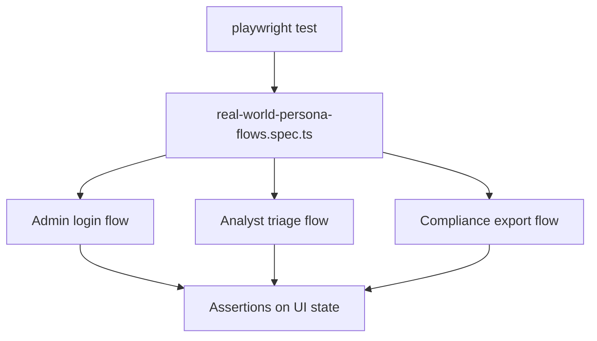

# PRD: Community 349 — Real-World Persona Flow E2E Tests

## Master Goal Mapping
**Goal:** Execute end-to-end Playwright tests simulating real ALDECI persona workflows (admin login, analyst triage, compliance export) against a running UI + API stack.

**Domain:** E2E Testing / Persona Flows
**Personas:** QA Engineer, Platform Engineer
**Node Count:** 1 | **Status:** Implemented

---

## Source Files
- `suite-ui/aldeci-ui-new/e2e/real-world-persona-flows.spec.ts`

## Graph Nodes (Labels)
- real-world-persona-flows.spec.ts

---

## Architecture Diagram



---

## Code Proof

- `suite-ui/aldeci-ui-new/e2e/real-world-persona-flows.spec.ts:L1` — Real-world persona E2E flows — Playwright spec

---

## Inter-Dependencies

- `suite-ui/aldeci-ui-new/playwright.config.ts`
- `suite-ui/aldeci-ui-new/e2e/helpers/endpoints.ts`
- `suite-api/apps/main.py`

### Community Link Dependencies
- No external community dependencies

---

## Data Flow

```
Playwright → UI login → API calls → dashboard renders → assertions on page content
```

---

## Referenced Docs

- `suite-ui/aldeci-ui-new/e2e/helpers/endpoints.ts`
- `tests/test_persona_workflows.py`

---

## Acceptance Criteria

- [ ] Admin can login and see admin menu
- [ ] Analyst can navigate to findings
- [ ] Compliance can reach evidence export

---

## Effort Estimate

**0.5 day (Trivial — isolated leaf module)**

---

## Status

**Implemented** — Module exists in codebase. Integration tests recommended.
