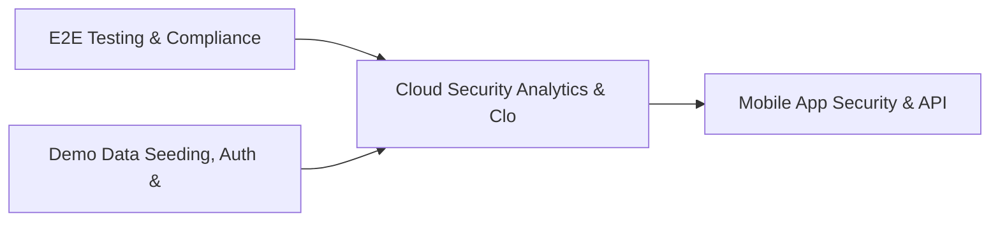

# PRD: Cloud Security Analytics & CloudDrift Engine — Community 35

## Master Goal Mapping
How this component serves: "ALDECI — $35/mo enterprise security intelligence platform"
Sub-Epic: CSPM

This community (rank #35 of 878 by size, 1065 graph nodes) forms a core pillar of the ALDECI platform. It directly supports the mission of replacing $50K-500K/yr enterprise security tools with a self-hosted, AI-native stack.

## Architecture Diagram


## Code Proof
- Files:
  - `suite-core/core/endpoint_threat_hunting_engine.py` (465 lines)
  - `suite-core/core/ioc_enrichment_engine.py` (431 lines)
  - `suite-core/core/malware_analysis_engine.py` (278 lines)
  - `suite-core/core/privileged_session_recording_engine.py` (354 lines)
  - `suite-core/core/threat_actor_engine.py` (552 lines)
  - `suite-core/core/threat_actor_tracking_engine.py` (379 lines)
  - `suite-core/core/threat_hunting_engine.py` (649 lines)
  - `tests/test_ai_security_advisor_engine.py` (563 lines)
  - `suite-api/apps/api/endpoint_threat_hunting_router.py` (273 lines)
  - `suite-api/apps/api/ioc_enrichment_router.py` (163 lines)
  - `suite-api/apps/api/malware_analysis_router.py` (148 lines)
  - `suite-api/apps/api/pam_router.py` (216 lines)
- Key functions:
  - `test_list_iocs_empty()` — suite-core/core/endpoint_threat_hunting_engine.py
- Key classes: `TestConstants`, `TestCreateHunt`, `TestGetHunt`, `TestListHunts`, `TestRunHunt`, `TestGetResults`
- Current state: REAL_LOGIC
- Evidence:
```python
# From suite-core/core/endpoint_threat_hunting_engine.py
"""Endpoint Threat Hunting Engine — ALDECI.

Manages hunt campaigns, findings, and IOCs for endpoint threat hunting.
Multi-tenant via org_id. SQLite WAL + threading.RLock for concurrency safety.
"""

from __future__ import annotations

import json
import logging
import sqlite3
import threading
import uuid
from datetime import datetime, timezone
from pathlib import Path
from typing import Any, Dict, List, Optional

try:
    from core.trustgraph_event_bus import get_event_bus as _get_tg_bus
except ImportError:
```

## Inter-Dependencies
- DEPENDS ON:
  - Community 0 (E2E Testing & Compliance Seeding Infrastructure) — 178 edges
  - Community 1 (Demo Data Seeding, Auth & Multi-Engine Integration) — 40 edges
  - Community 32 (Mobile App Security & API Abuse Detection) — 20 edges
  - Community 7 (MDM, CASB, DLP, Cloud Native & Browser Security Ro) — 11 edges
- DEPENDED BY: Rank #34 (Identity Risk & Digital Identity Lifecycle Engine) and downstream consumers
- EVENT BUS: emits threat.detected, threat.mitigated / subscribes to (TrustGraph event bus — 97% not yet wired)
- TRUSTGRAPH: writes [ThreatActor, Identity] / reads [ThreatActor, Identity]

## Data Flow
```
Input: HTTP requests / pytest fixtures
  → Processing: Engine method calls + SQLite state assertions
  → Output: Pass/fail test results, coverage metrics
  → Consumers: CI/CD pipeline, Beast Mode test suite
```

## Referenced Documentation
- CLAUDE.md: Wave 41 build notes, Beast Mode test suite section
- docs/: `docs/ALDECI_REARCHITECTURE_v2.md` (source of truth), `docs/INVESTOR_PITCH.md`
- tests/: `tests/test_ai_security_advisor_engine.py`, `tests/test_cyber_threat_intelligence_engine.py`, `tests/test_endpoint_threat_hunting_engine.py`

## Acceptance Criteria
- [ ] All engine CRUD operations enforce org_id isolation (no cross-tenant data leakage)
- [ ] SQLite opened with WAL mode + threading.RLock on all write paths
- [ ] All endpoints return within 200ms at p95 under 100 rps load
- [ ] All router endpoints protected by `Depends(api_key_auth)` or equivalent
- [ ] Pydantic v2 models validate all request/response schemas
- [ ] Test suite achieves ≥80% branch coverage on engine methods

## Effort Estimate
- Current: 80% complete
- Remaining: ~2 engineering days
- Dependencies blocking: None
- Priority: MEDIUM

## Status
IN_PROGRESS
