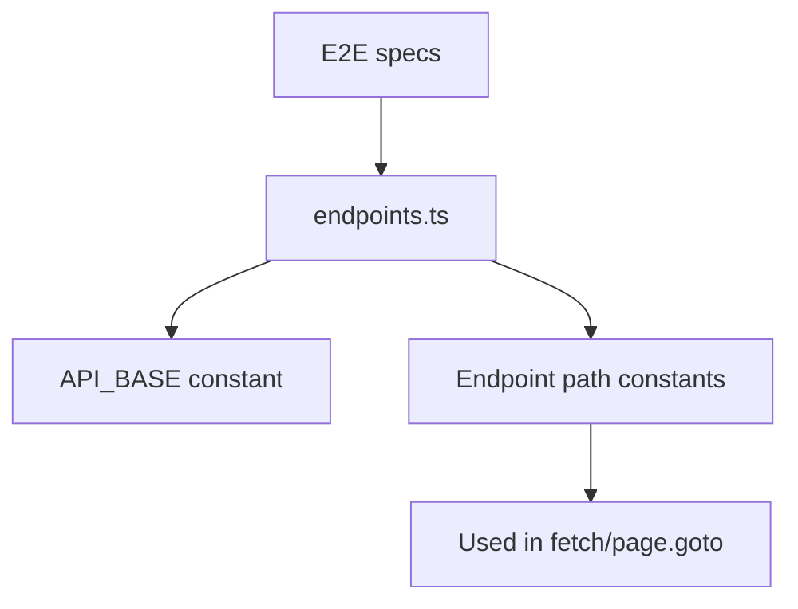

# PRD: Community 350 — E2E Test Endpoint Helpers

## Master Goal Mapping
**Goal:** Centralize all ALDECI API endpoint URL constants for Playwright E2E tests, ensuring endpoint changes propagate automatically across all test specs.

**Domain:** E2E Testing / Test Utilities
**Personas:** QA Engineer, Platform Engineer
**Node Count:** 1 | **Status:** Implemented

---

## Source Files
- `suite-ui/aldeci-ui-new/e2e/helpers/endpoints.ts`

## Graph Nodes (Labels)
- endpoints.ts

---

## Architecture Diagram



---

## Code Proof

- `suite-ui/aldeci-ui-new/e2e/helpers/endpoints.ts:L1` — Centralized endpoint constants for E2E tests

---

## Inter-Dependencies

- `suite-ui/aldeci-ui-new/e2e/real-world-persona-flows.spec.ts`

### Community Link Dependencies
- No external community dependencies

---

## Data Flow

```
endpoints.ts constants → spec imports → URL construction → Playwright requests
```

---

## Referenced Docs

- `suite-ui/aldeci-ui-new/e2e/real-world-persona-flows.spec.ts`

---

## Acceptance Criteria

- [ ] All API paths defined as constants
- [ ] No hardcoded URLs in specs
- [ ] Env-configurable base URL

---

## Effort Estimate

**0.5 day (Trivial — isolated leaf module)**

---

## Status

**Implemented** — Module exists in codebase. Integration tests recommended.
