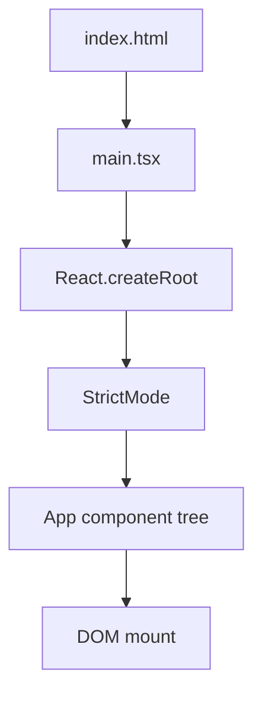

# PRD: Community 351 — React App Entry Point (main.tsx)

## Master Goal Mapping
**Goal:** Bootstrap the aldeci-ui-new React 19 application by mounting the root component into the DOM, enabling React concurrent features and strict mode for development quality.

**Domain:** Frontend / React Bootstrap
**Personas:** Frontend Developer
**Node Count:** 1 | **Status:** Implemented

---

## Source Files
- `suite-ui/aldeci-ui-new/src/main.tsx`

## Graph Nodes (Labels)
- main.tsx

---

## Architecture Diagram



---

## Code Proof

- `suite-ui/aldeci-ui-new/src/main.tsx:L1` — React 19 app bootstrap with createRoot and StrictMode

---

## Inter-Dependencies

- `suite-ui/aldeci-ui-new/src/App.tsx`
- `suite-ui/aldeci-ui-new/src/index.css`

### Community Link Dependencies
- No external community dependencies

---

## Data Flow

```
HTML #root element → createRoot() → render(<StrictMode><App/></StrictMode>) → React tree
```

---

## Referenced Docs

- `React 19 docs §createRoot`
- `suite-ui/aldeci-ui-new/src/App.tsx`

---

## Acceptance Criteria

- [ ] App mounts without console errors
- [ ] StrictMode enabled in dev
- [ ] React.createRoot used (not legacy render)

---

## Effort Estimate

**0.5 day (Trivial — isolated leaf module)**

---

## Status

**Implemented** — Module exists in codebase. Integration tests recommended.
