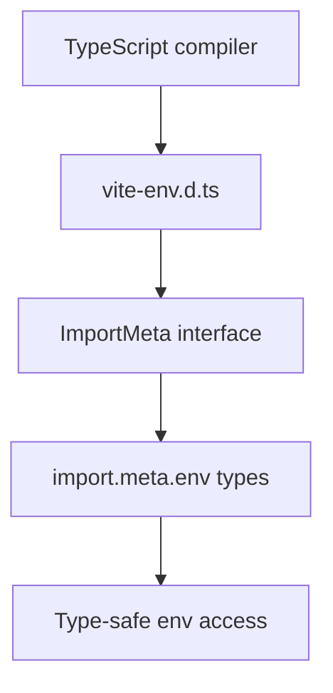

# PRD: Community 352 — Vite Environment Type Declarations

## Master Goal Mapping
**Goal:** Provide TypeScript type declarations for Vite environment variables (import.meta.env) in aldeci-ui-new, enabling type-safe access to build-time configuration.

**Domain:** Frontend / TypeScript
**Personas:** Frontend Developer
**Node Count:** 1 | **Status:** Implemented

---

## Source Files
- `suite-ui/aldeci-ui-new/src/vite-env.d.ts`

## Graph Nodes (Labels)
- vite-env.d.ts

---

## Architecture Diagram



---

## Code Proof

- `suite-ui/aldeci-ui-new/src/vite-env.d.ts:L1` — Vite environment variable type declarations

---

## Inter-Dependencies

- `suite-ui/aldeci-ui-new/vite.config.ts`
- `TypeScript`

### Community Link Dependencies
- No external community dependencies

---

## Data Flow

```
vite-env.d.ts → tsc → ImportMeta.env typed → import.meta.env.VITE_API_URL usage
```

---

## Referenced Docs

- `Vite docs §env variables`
- `TypeScript handbook §declaration files`

---

## Acceptance Criteria

- [ ] import.meta.env.VITE_* is typed
- [ ] No TS errors on env access
- [ ] MODE/DEV/PROD flags typed

---

## Effort Estimate

**0.5 day (Trivial — isolated leaf module)**

---

## Status

**Implemented** — Module exists in codebase. Integration tests recommended.
