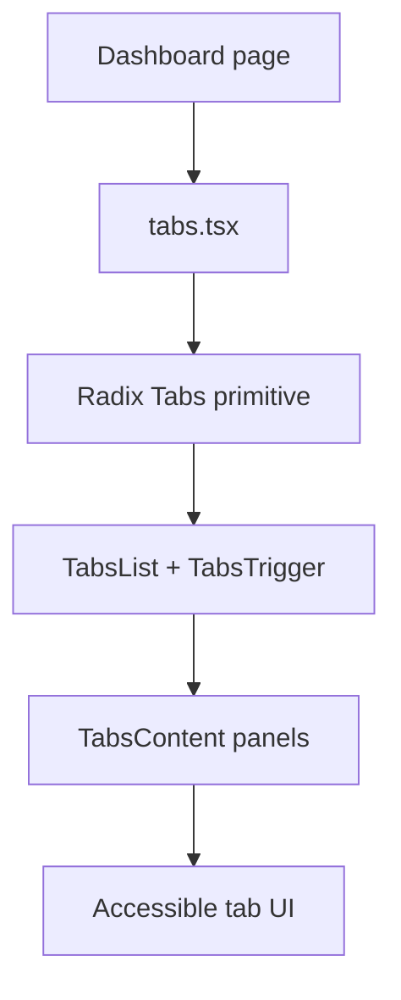

# PRD: Community 353 — UI Tabs Component

## Master Goal Mapping
**Goal:** Provide the reusable Tabs/TabsList/TabsTrigger/TabsContent shadcn/ui component for ALDECI dashboard pages, enabling tabbed navigation between dashboard sections.

**Domain:** Frontend / UI Components
**Personas:** Frontend Developer
**Node Count:** 1 | **Status:** Implemented

---

## Source Files
- `suite-ui/aldeci-ui-new/src/components/ui/tabs.tsx`

## Graph Nodes (Labels)
- tabs.tsx

---

## Architecture Diagram



---

## Code Proof

- `suite-ui/aldeci-ui-new/src/components/ui/tabs.tsx:L1` — Radix UI tabs primitive wrapper — shadcn/ui pattern

---

## Inter-Dependencies

- `@radix-ui/react-tabs`
- `suite-ui/aldeci-ui-new/src/lib/utils.ts`

### Community Link Dependencies
- No external community dependencies

---

## Data Flow

```
page import Tabs → JSX render → Radix state machine → keyboard nav → content show/hide
```

---

## Referenced Docs

- `Radix UI Tabs docs`
- `shadcn/ui docs`

---

## Acceptance Criteria

- [ ] Tab switching works with keyboard
- [ ] Active tab highlighted
- [ ] Accessible ARIA roles

---

## Effort Estimate

**0.5 day (Trivial — isolated leaf module)**

---

## Status

**Implemented** — Module exists in codebase. Integration tests recommended.
