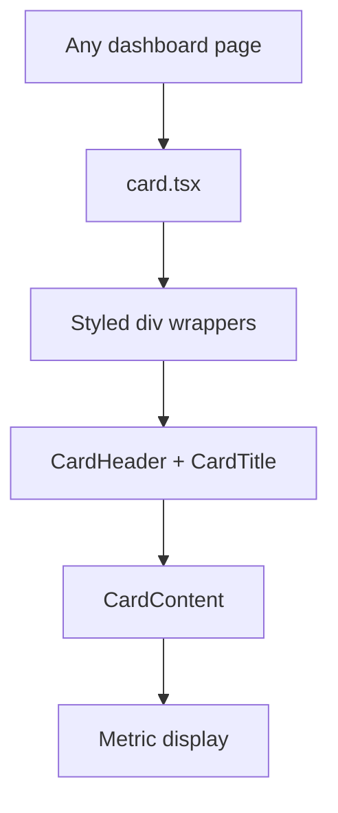

# PRD: Community 354 — UI Card Component

## Master Goal Mapping
**Goal:** Provide the reusable Card/CardHeader/CardTitle/CardContent shadcn/ui component used across all 296+ ALDECI dashboard pages for consistent metric display containers.

**Domain:** Frontend / UI Components
**Personas:** Frontend Developer
**Node Count:** 1 | **Status:** Implemented

---

## Source Files
- `suite-ui/aldeci-ui-new/src/components/ui/card.tsx`

## Graph Nodes (Labels)
- card.tsx

---

## Architecture Diagram



---

## Code Proof

- `suite-ui/aldeci-ui-new/src/components/ui/card.tsx:L1` — shadcn/ui Card component — most-used UI primitive in ALDECI

---

## Inter-Dependencies

- `suite-ui/aldeci-ui-new/src/lib/utils.ts`
- `Tailwind v4`

### Community Link Dependencies
- No external community dependencies

---

## Data Flow

```
page → <Card><CardHeader><CardTitle>...</CardTitle></CardHeader><CardContent/></Card> → styled div tree
```

---

## Referenced Docs

- `shadcn/ui docs §Card`
- `Tailwind v4`

---

## Acceptance Criteria

- [ ] Renders with correct border/shadow
- [ ] CardTitle bold, correct size
- [ ] Responsive on mobile breakpoints

---

## Effort Estimate

**0.5 day (Trivial — isolated leaf module)**

---

## Status

**Implemented** — Module exists in codebase. Integration tests recommended.
