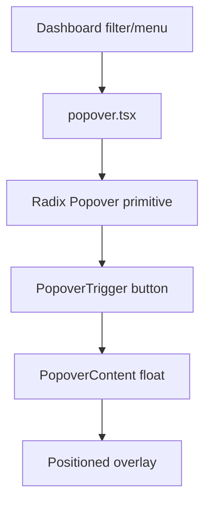

# PRD: Community 355 — UI Popover Component

## Master Goal Mapping
**Goal:** Provide the reusable Popover/PopoverTrigger/PopoverContent shadcn/ui component for ALDECI contextual menus, tooltips, and filter panels on dashboard pages.

**Domain:** Frontend / UI Components
**Personas:** Frontend Developer
**Node Count:** 1 | **Status:** Implemented

---

## Source Files
- `suite-ui/aldeci-ui-new/src/components/ui/popover.tsx`

## Graph Nodes (Labels)
- popover.tsx

---

## Architecture Diagram



---

## Code Proof

- `suite-ui/aldeci-ui-new/src/components/ui/popover.tsx:L1` — Radix Popover wrapper — shadcn/ui pattern

---

## Inter-Dependencies

- `@radix-ui/react-popover`
- `suite-ui/aldeci-ui-new/src/lib/utils.ts`

### Community Link Dependencies
- No external community dependencies

---

## Data Flow

```
trigger click → Radix portal mount → positioned content → focus trap → outside click dismiss
```

---

## Referenced Docs

- `Radix UI Popover docs`
- `shadcn/ui docs §Popover`

---

## Acceptance Criteria

- [ ] Opens on trigger click
- [ ] Dismisses on outside click
- [ ] Positioned correctly (bottom/top)

---

## Effort Estimate

**0.5 day (Trivial — isolated leaf module)**

---

## Status

**Implemented** — Module exists in codebase. Integration tests recommended.
