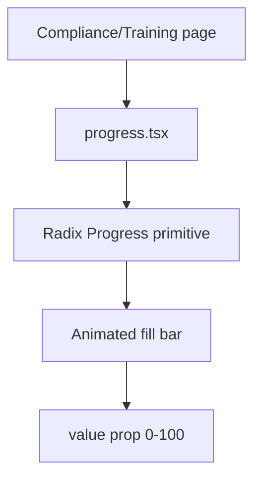

# PRD: Community 356 — UI Progress Bar Component

## Master Goal Mapping
**Goal:** Provide the reusable Progress shadcn/ui component for ALDECI compliance scores, training completion, and coverage percentage visual indicators across all dashboards.

**Domain:** Frontend / UI Components
**Personas:** Frontend Developer
**Node Count:** 1 | **Status:** Implemented

---

## Source Files
- `suite-ui/aldeci-ui-new/src/components/ui/progress.tsx`

## Graph Nodes (Labels)
- progress.tsx

---

## Architecture Diagram



---

## Code Proof

- `suite-ui/aldeci-ui-new/src/components/ui/progress.tsx:L1` — Radix Progress bar wrapper — shadcn/ui pattern

---

## Inter-Dependencies

- `@radix-ui/react-progress`
- `Tailwind v4`

### Community Link Dependencies
- No external community dependencies

---

## Data Flow

```
value prop → CSS width% → animated transition → visual progress bar
```

---

## Referenced Docs

- `Radix UI Progress docs`
- `shadcn/ui docs §Progress`

---

## Acceptance Criteria

- [ ] value=0 → empty bar
- [ ] value=100 → full bar
- [ ] Smooth CSS transition on value change

---

## Effort Estimate

**0.5 day (Trivial — isolated leaf module)**

---

## Status

**Implemented** — Module exists in codebase. Integration tests recommended.
