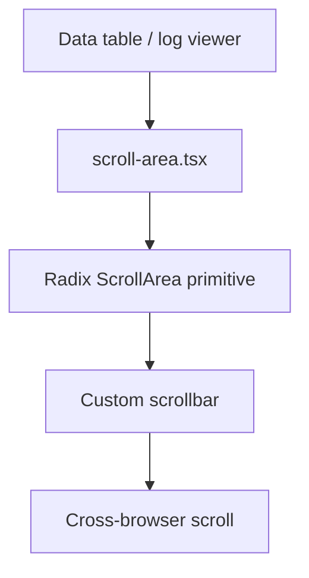

# PRD: Community 357 — UI Scroll Area Component

## Master Goal Mapping
**Goal:** Provide the reusable ScrollArea shadcn/ui component for ALDECI data tables, log viewers, and findings lists, enabling custom-styled scrollbars across all dashboard pages.

**Domain:** Frontend / UI Components
**Personas:** Frontend Developer
**Node Count:** 1 | **Status:** Implemented

---

## Source Files
- `suite-ui/aldeci-ui-new/src/components/ui/scroll-area.tsx`

## Graph Nodes (Labels)
- scroll-area.tsx

---

## Architecture Diagram



---

## Code Proof

- `suite-ui/aldeci-ui-new/src/components/ui/scroll-area.tsx:L1` — Radix ScrollArea wrapper — custom styled scrollbars

---

## Inter-Dependencies

- `@radix-ui/react-scroll-area`
- `Tailwind v4`

### Community Link Dependencies
- No external community dependencies

---

## Data Flow

```
overflow content → Radix viewport → custom scrollbar thumb/track → scroll events
```

---

## Referenced Docs

- `Radix UI ScrollArea docs`
- `shadcn/ui docs §ScrollArea`

---

## Acceptance Criteria

- [ ] Custom scrollbar visible on overflow
- [ ] Works on Chrome/Firefox/Safari
- [ ] Touch scroll supported

---

## Effort Estimate

**0.5 day (Trivial — isolated leaf module)**

---

## Status

**Implemented** — Module exists in codebase. Integration tests recommended.
