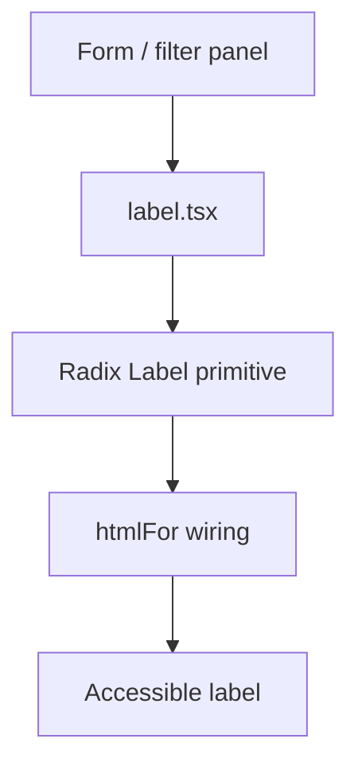

# PRD: Community 358 — UI Label Component

## Master Goal Mapping
**Goal:** Provide the reusable Label shadcn/ui component for ALDECI form fields, filter inputs, and settings panels, ensuring accessible form labeling across all dashboard forms.

**Domain:** Frontend / UI Components
**Personas:** Frontend Developer
**Node Count:** 1 | **Status:** Implemented

---

## Source Files
- `suite-ui/aldeci-ui-new/src/components/ui/label.tsx`

## Graph Nodes (Labels)
- label.tsx

---

## Architecture Diagram



---

## Code Proof

- `suite-ui/aldeci-ui-new/src/components/ui/label.tsx:L1` — Radix Label wrapper — accessible form labels

---

## Inter-Dependencies

- `@radix-ui/react-label`
- `Tailwind v4`

### Community Link Dependencies
- No external community dependencies

---

## Data Flow

```
htmlFor → associated input → ARIA labelledby → screen reader announcement
```

---

## Referenced Docs

- `Radix UI Label docs`
- `WCAG 2.1 SC 1.3.1`

---

## Acceptance Criteria

- [ ] Label click focuses associated input
- [ ] ARIA labelledby correct
- [ ] Styled with Tailwind text-sm font-medium

---

## Effort Estimate

**0.5 day (Trivial — isolated leaf module)**

---

## Status

**Implemented** — Module exists in codebase. Integration tests recommended.
