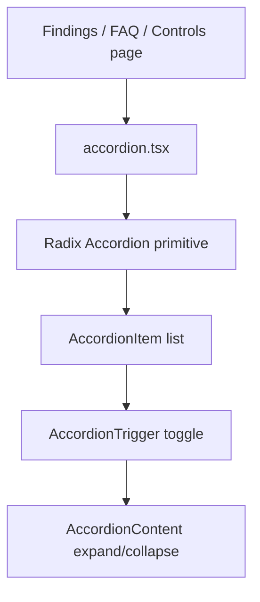

# PRD: Community 359 — UI Accordion Component

## Master Goal Mapping
**Goal:** Provide the reusable Accordion/AccordionItem/AccordionTrigger/AccordionContent shadcn/ui component for ALDECI FAQ sections, collapsible finding details, and nested compliance controls.

**Domain:** Frontend / UI Components
**Personas:** Frontend Developer
**Node Count:** 1 | **Status:** Implemented

---

## Source Files
- `suite-ui/aldeci-ui-new/src/components/ui/accordion.tsx`

## Graph Nodes (Labels)
- accordion.tsx

---

## Architecture Diagram



---

## Code Proof

- `suite-ui/aldeci-ui-new/src/components/ui/accordion.tsx:L1` — Radix Accordion wrapper — collapsible content sections

---

## Inter-Dependencies

- `@radix-ui/react-accordion`
- `Tailwind v4`
- `lucide-react (ChevronDown)`

### Community Link Dependencies
- No external community dependencies

---

## Data Flow

```
trigger click → Radix state → AnimatePresence → height transition → content shown/hidden
```

---

## Referenced Docs

- `Radix UI Accordion docs`
- `shadcn/ui docs §Accordion`

---

## Acceptance Criteria

- [ ] Single/multiple expand modes supported
- [ ] ChevronDown rotates on open
- [ ] Keyboard arrow key navigation works

---

## Effort Estimate

**0.5 day (Trivial — isolated leaf module)**

---

## Status

**Implemented** — Module exists in codebase. Integration tests recommended.
