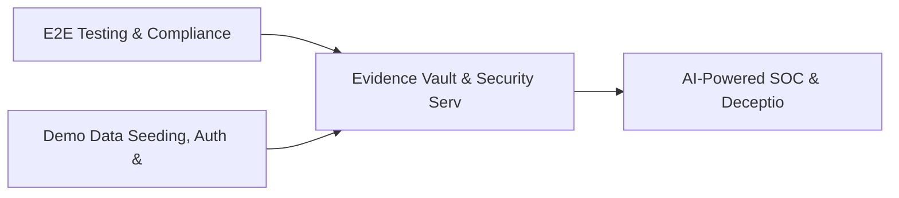

# PRD: Evidence Vault & Security Service Catalog — Community 36

## Master Goal Mapping
How this component serves: "ALDECI — $35/mo enterprise security intelligence platform"
Sub-Epic: GRC

This community (rank #36 of 878 by size, 1003 graph nodes) forms a core pillar of the ALDECI platform. It directly supports the mission of replacing $50K-500K/yr enterprise security tools with a self-hosted, AI-native stack.

## Architecture Diagram


## Code Proof
- Files:
  - `suite-api/apps/api/incident_response_router.py` (310 lines)
  - `suite-api/apps/api/integration_hub_router.py` (360 lines)
  - `suite-api/apps/api/n8n_router.py` (155 lines)
  - `suite-api/apps/api/onboarding_router.py` (223 lines)
  - `suite-api/apps/api/security_metrics_router.py` (515 lines)
  - `suite-api/apps/api/sso_router.py` (390 lines)
  - `suite-api/apps/api/webhook_events_router.py` (200 lines)
  - `suite-core/api/material_change_router.py` (653 lines)
  - `tests/test_airgap_deployment.py` (878 lines)
  - `tests/test_beast_mode_integration.py` (625 lines)
  - `tests/test_brain_pipeline_coverage.py` (660 lines)
  - `tests/test_cli_scanner.py` (628 lines)
- Key functions:
  - `stream()` — suite-api/apps/api/incident_response_router.py
  - `connector()` — suite-api/apps/api/incident_response_router.py
  - `test_register_webhook_creates_record()` — suite-api/apps/api/incident_response_router.py
  - `test_register_webhook_invalid_event_type_raises()` — suite-api/apps/api/incident_response_router.py
  - `test_register_multiple_event_types()` — suite-api/apps/api/incident_response_router.py
  - `test_unregister_webhook_removes_record()` — suite-api/apps/api/incident_response_router.py
  - `test_unregister_nonexistent_returns_false()` — suite-api/apps/api/incident_response_router.py
  - `test_list_webhooks_returns_list()` — suite-api/apps/api/incident_response_router.py
- Key classes: N/A
- Current state: PARTIAL
- Evidence:
```python
# From suite-api/apps/api/incident_response_router.py
"""Incident Response Playbook API endpoints.

Provides runbook management, timeline tracking, and post-incident review:
- Create/list/get incidents with auto-populated playbook steps
- State machine status transitions
- Step assignment and completion
- Timeline event logging
- Finding/evidence linking
- Post-mortem creation and retrieval
- Playbook templates and statistics
"""

from __future__ import annotations

import logging
from typing import Any, Dict, List, Optional

from fastapi import APIRouter, HTTPException, Query
from pydantic import BaseModel
```

## Inter-Dependencies
- DEPENDS ON:
  - Community 0 (E2E Testing & Compliance Seeding Infrastructure) — 134 edges
  - Community 1 (Demo Data Seeding, Auth & Multi-Engine Integration) — 78 edges
  - Community 30 (AI-Powered SOC & Deception Analytics Engine) — 28 edges
  - Community 20 (Secrets Management & API Gateway Security) — 19 edges
- DEPENDED BY: Rank #35 (Cloud Security Analytics & CloudDrift Engine) and downstream consumers
- EVENT BUS: emits (none currently wired) / subscribes to (TrustGraph event bus — 97% not yet wired)
- TRUSTGRAPH: writes [Incident] / reads [Incident]

## Data Flow
```
Input: HTTP requests / pytest fixtures
  → Processing: Engine method calls + SQLite state assertions
  → Output: Pass/fail test results, coverage metrics
  → Consumers: CI/CD pipeline, Beast Mode test suite
```

## Referenced Documentation
- CLAUDE.md: Wave 41 build notes, Beast Mode test suite section
- docs/: `docs/ALDECI_REARCHITECTURE_v2.md` (source of truth), `docs/INVESTOR_PITCH.md`
- tests/: `tests/test_airgap_deployment.py`, `tests/test_beast_mode_integration.py`, `tests/test_brain_pipeline_coverage.py`

## Acceptance Criteria
- [ ] All router endpoints protected by `Depends(api_key_auth)` or equivalent
- [ ] Pydantic v2 models validate all request/response schemas
- [ ] Test suite achieves ≥80% branch coverage on engine methods
- [ ] All tests pass with `pytest --timeout=10 -q` in <30 seconds

## Effort Estimate
- Current: 45% complete
- Remaining: ~10 engineering days
- Dependencies blocking: Engine implementation incomplete
- Priority: MEDIUM

## Status
IN_PROGRESS
