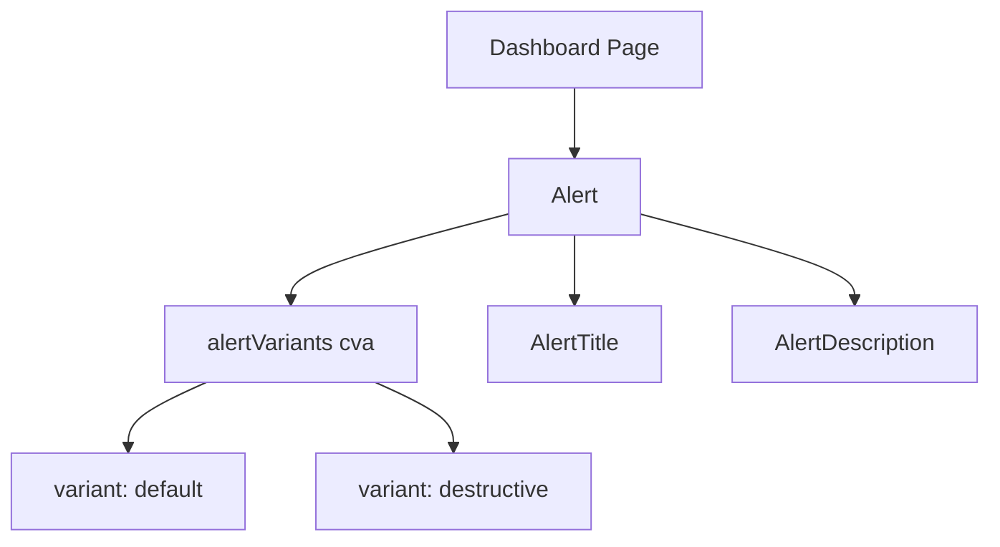

# Community 361 PRD — alert.tsx

## Master Goal Mapping
Display contextual alert banners (info, error, warning) within dashboard cards and form flows.

## Architecture Diagram


## Code Proof
`suite-ui/aldeci-ui-new/src/components/ui/alert.tsx:5-14`
```tsx
const alertVariants = cva(
  "relative w-full rounded-lg border px-4 py-3 text-sm [&>svg+div]:translate-y-[-3px] [&>svg]:absolute [&>svg]:left-4 [&>svg]:top-4",
  { variants: { variant: { default: "bg-background text-foreground",
      destructive: "border-destructive/50 text-destructive" } },
    defaultVariants: { variant: "default" } }
);
```

## Inter-Dependencies
- **Imports**: `cva`, `cn`
- **Consumers**: ErrorState, form validation feedback, compliance gap banners, overdue detection alerts

## Data Flow
Pure presentational — no API calls. Variant prop drives CSS class selection via `cva`.

## Referenced Docs
- WCAG 1.3.3 — Sensory Characteristics (color + text convey meaning)

## Acceptance Criteria
- [ ] `role="alert"` present on root div for screen readers
- [ ] `destructive` variant uses `border-destructive/50 text-destructive`
- [ ] SVG icons align at `top-4 left-4` when used inside Alert

## Effort Estimate
Already implemented. **0 SP**

## Status
DONE — production ready
