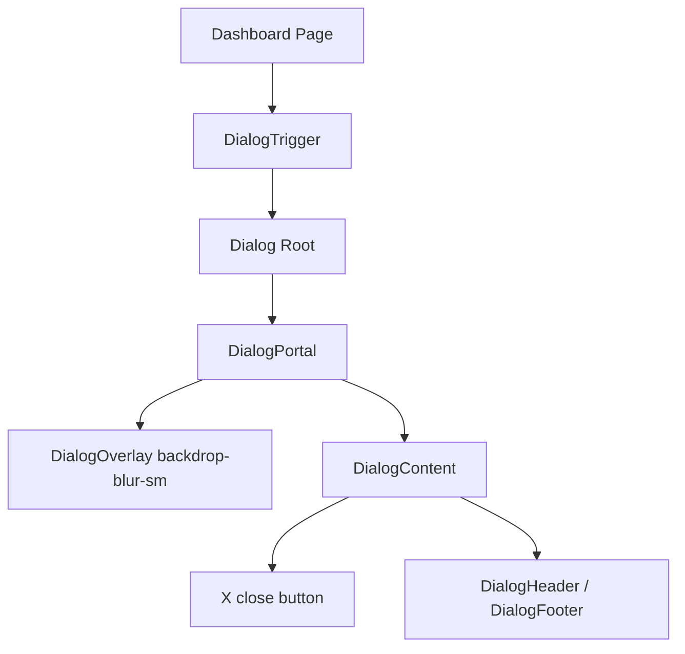

# Community 364 PRD — dialog.tsx

## Master Goal Mapping
Modal dialogs for confirm actions, detail drilldowns, and form flows across all ALDECI dashboards.

## Architecture Diagram


## Code Proof
`suite-ui/aldeci-ui-new/src/components/ui/dialog.tsx:13-22`
```tsx
const DialogOverlay = forwardRef(({ className, ...props }, ref) => (
  <DialogPrimitive.Overlay
    className={cn("fixed inset-0 z-50 bg-black/60 backdrop-blur-sm data-[state=open]:animate-in data-[state=closed]:animate-out data-[state=closed]:fade-out-0 data-[state=open]:fade-in-0")}
  />
));
```

## Inter-Dependencies
- **Imports**: `@radix-ui/react-dialog`, `lucide-react/X`, `cn`
- **Consumers**: Remediation confirm dialogs, evidence detail drilldown, playbook execution confirm, attack simulation trigger

## Data Flow
Portal-rendered outside DOM tree. `open` / `onOpenChange` state in parent. Form submissions inside dialog call mutation APIs.

## Acceptance Criteria
- [ ] `backdrop-blur-sm` overlay on open
- [ ] X button in top-right corner closes dialog
- [ ] Animate-in/out transitions on open/close
- [ ] Focus trapped inside dialog (Radix default)
- [ ] ESC key closes dialog

## Effort Estimate
Already implemented. **0 SP**

## Status
DONE — production ready
