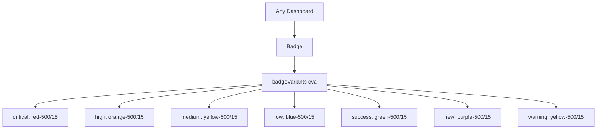

# Community 365 PRD — badge.tsx

## Master Goal Mapping
Severity classification labels (critical/high/medium/low), status indicators (success/warning), and feature tags (new) across all ALDECI UI.

## Architecture Diagram


## Code Proof
`suite-ui/aldeci-ui-new/src/components/ui/badge.tsx:5-22`
```tsx
const badgeVariants = cva(
  "inline-flex items-center rounded-md border px-2 py-0.5 text-xs font-medium transition-colors",
  { variants: { variant: {
    critical: "border-transparent bg-red-500/15 text-red-400",
    high: "border-transparent bg-orange-500/15 text-orange-400",
    medium: "border-transparent bg-yellow-500/15 text-yellow-400",
    low: "border-transparent bg-blue-500/15 text-blue-400",
    success: "border-transparent bg-green-500/15 text-green-400",
    new: "border-transparent bg-purple-500/15 text-purple-400",
  }}}
);
```

## Inter-Dependencies
- **Imports**: `cva`, `cn`
- **Consumers**: CVE severity labels, incident priority, finding severity, TLP classification, PageHeader `badge` prop

## Data Flow
Variant prop maps severity string from API response → CSS color class.

## Acceptance Criteria
- [ ] 12 variants all render with correct bg/text color pair
- [ ] `px-2 py-0.5 text-xs` sizing consistent
- [ ] `variant="new"` used in PageHeader badge slot

## Effort Estimate
Already implemented. **0 SP**

## Status
DONE — production ready
