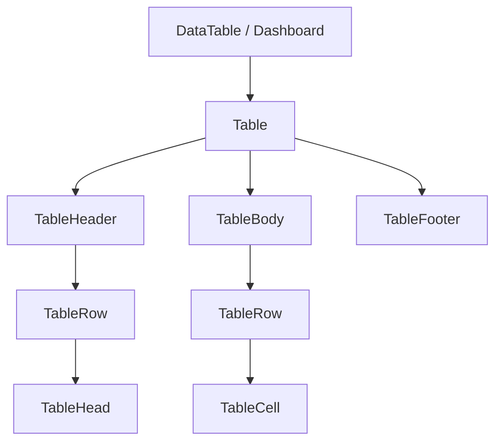

# Community 366 PRD — table.tsx

## Master Goal Mapping
Semantic HTML table primitives used by DataTable and all manual table layouts in ALDECI dashboards.

## Architecture Diagram


## Code Proof
`suite-ui/aldeci-ui-new/src/components/ui/table.tsx:4-10`
```tsx
const Table = forwardRef(({ className, ...props }, ref) => (
  <div className="relative w-full overflow-auto">
    <table ref={ref} className={cn("w-full caption-bottom text-sm", className)} />
  </div>
));
const TableRow = forwardRef(({ className, ...props }, ref) => (
  <tr className={cn("border-b transition-colors hover:bg-muted/50 data-[state=selected]:bg-muted")} />
));
```

## Inter-Dependencies
- **Imports**: `cn`
- **Consumers**: DataTable generic component, CVE tables, finding tables, audit log tables, all 296+ pages with tabular data

## Data Flow
Pure layout — no API calls. Receives data via `data` prop in DataTable wrapper.

## Acceptance Criteria
- [ ] `overflow-auto` wrapper prevents horizontal overflow breaking layout
- [ ] `hover:bg-muted/50` row highlight on hover
- [ ] `data-[state=selected]:bg-muted` selection state

## Effort Estimate
Already implemented. **0 SP**

## Status
DONE — production ready
