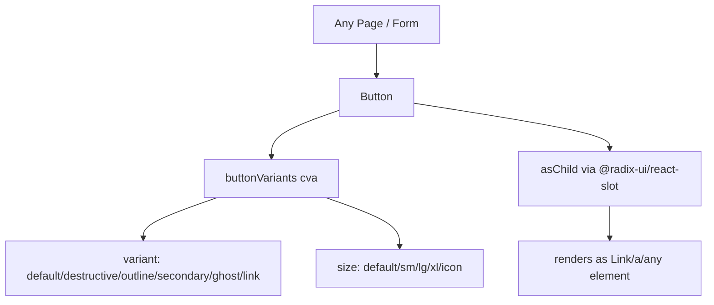

# Community 368 PRD — button.tsx

## Master Goal Mapping
Primary interactive control for all user actions across ALDECI — form submits, navigation triggers, mutation confirmations.

## Architecture Diagram


## Code Proof
`suite-ui/aldeci-ui-new/src/components/ui/button.tsx:7-27`
```tsx
const buttonVariants = cva(
  "inline-flex items-center ... active:scale-[0.98]",
  { variants: {
    variant: {
      default: "bg-primary text-primary-foreground shadow-sm hover:bg-primary/90 active:scale-[0.98]",
      destructive: "bg-destructive text-destructive-foreground",
      outline: "border border-border bg-transparent hover:bg-accent",
      ghost: "hover:bg-accent hover:text-accent-foreground",
    },
    size: { default: "h-9 px-4 py-2", sm: "h-8 px-3 text-xs", lg: "h-10 px-6", xl: "h-12 px-8 text-base", icon: "h-9 w-9" }
  }}
);
```

## Inter-Dependencies
- **Imports**: `@radix-ui/react-slot` (asChild), `cva`, `cn`
- **Consumers**: Every dashboard page — form submits, action menus, modal triggers, nav links

## Data Flow
`onClick` → parent mutation handler → API call. `asChild` enables use as router `<Link>`.

## Acceptance Criteria
- [ ] 6 variants all render with correct colors
- [ ] 5 sizes maintained
- [ ] `active:scale-[0.98]` press animation on default variant
- [ ] `asChild` renders correct DOM element
- [ ] `disabled:pointer-events-none disabled:opacity-50`

## Effort Estimate
Already implemented. **0 SP**

## Status
DONE — production ready
