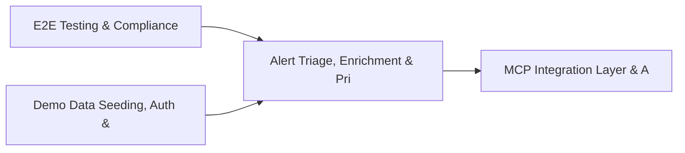

# PRD: Alert Triage, Enrichment & Priority Queue Engine — Community 37

## Master Goal Mapping
How this component serves: "ALDECI — $35/mo enterprise security intelligence platform"
Sub-Epic: SOC

This community (rank #37 of 878 by size, 1002 graph nodes) forms a core pillar of the ALDECI platform. It directly supports the mission of replacing $50K-500K/yr enterprise security tools with a self-hosted, AI-native stack.

## Architecture Diagram


## Code Proof
- Files:
  - `suite-core/core/pki_management_engine.py` (456 lines)
  - `suite-core/core/rbac_engine.py` (361 lines)
  - `tests/test_pki_management_engine.py` (309 lines)
  - `tests/test_rbac_engine.py` (319 lines)
  - `suite-api/apps/api/audit_router.py` (574 lines)
  - `suite-api/apps/api/compliance_reports_router.py` (177 lines)
  - `suite-api/apps/api/license_scanner_router.py` (249 lines)
  - `suite-api/apps/api/rbac_router.py` (197 lines)
  - `suite-api/apps/api/retention_router.py` (205 lines)
  - `suite-core/api/deduplication_router.py` (500 lines)
  - `suite-ui/aldeci-ui-new/e2e/global-setup.ts` (80 lines)
  - `tests/test_audit_api.py` (302 lines)
- Key functions:
  - `nav()` — suite-core/core/pki_management_engine.py
  - `mgr()` — suite-core/core/pki_management_engine.py
  - `mgr_with_policies()` — suite-core/core/pki_management_engine.py
  - `test_data_category_values()` — suite-core/core/pki_management_engine.py
  - `test_data_category_count()` — suite-core/core/pki_management_engine.py
  - `test_get_default_policies_returns_all_categories()` — suite-core/core/pki_management_engine.py
  - `test_default_policy_audit_logs_7_years()` — suite-core/core/pki_management_engine.py
  - `test_default_policy_metrics_90_days()` — suite-core/core/pki_management_engine.py
- Key classes: `TestFullPipelineFlow`, `TestPersonaEndToEnd`, `TestSystemResilience`
- Current state: REAL_LOGIC
- Evidence:
```python
# From suite-core/core/pki_management_engine.py
"""PKI Management Engine — ALDECI.

Manages PKI certificates and certificate authorities across their full
lifecycle: issuance, revocation, expiry monitoring, and audit logging.

Compliance: NIST SP 800-57, CABF Baseline Requirements, ISO/IEC 27001 A.10
"""

from __future__ import annotations

import json
import logging
import sqlite3
import threading
import uuid
from datetime import datetime, timedelta, timezone
from pathlib import Path
from typing import Any, Dict, List, Optional

try:
```

## Inter-Dependencies
- DEPENDS ON:
  - Community 0 (E2E Testing & Compliance Seeding Infrastructure) — 130 edges
  - Community 1 (Demo Data Seeding, Auth & Multi-Engine Integration) — 86 edges
  - Community 3 (MCP Integration Layer & API Key / Auth Management) — 20 edges
  - Community 5 (API Bridge, Docs Portal & Cross-Dashboard Infrastr) — 20 edges
- DEPENDED BY: Rank #36 (Evidence Vault & Security Service Catalog) and downstream consumers
- EVENT BUS: emits compliance.status_changed, policy.violated, policy.enforced / subscribes to (TrustGraph event bus — 97% not yet wired)
- TRUSTGRAPH: writes [Policy, ComplianceControl] / reads [Policy, ComplianceControl]

## Data Flow
```
Input: HTTP requests / pytest fixtures
  → Processing: Engine method calls + SQLite state assertions
  → Output: Pass/fail test results, coverage metrics
  → Consumers: CI/CD pipeline, Beast Mode test suite
```

## Referenced Documentation
- CLAUDE.md: Wave 41 build notes, Beast Mode test suite section
- docs/: `docs/ALDECI_REARCHITECTURE_v2.md` (source of truth), `docs/INVESTOR_PITCH.md`
- tests/: `tests/test_audit_api.py`, `tests/test_audit_db.py`, `tests/test_bulk_operations.py`

## Acceptance Criteria
- [ ] All engine CRUD operations enforce org_id isolation (no cross-tenant data leakage)
- [ ] SQLite opened with WAL mode + threading.RLock on all write paths
- [ ] All endpoints return within 200ms at p95 under 100 rps load
- [ ] All router endpoints protected by `Depends(api_key_auth)` or equivalent
- [ ] Pydantic v2 models validate all request/response schemas
- [ ] Test suite achieves ≥80% branch coverage on engine methods

## Effort Estimate
- Current: 95% complete
- Remaining: ~1 engineering days
- Dependencies blocking: None
- Priority: MEDIUM

## Status
IN_PROGRESS
