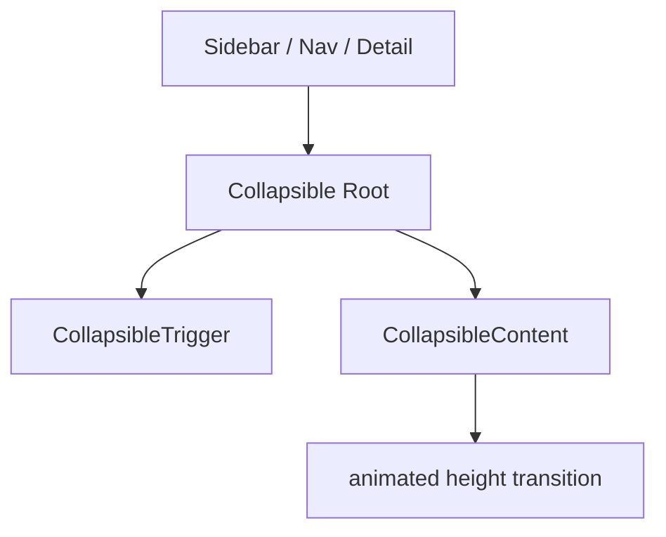

# Community 370 PRD — collapsible.tsx

## Master Goal Mapping
Expand/collapse sections in sidebars, nav groups, and detail panels.

## Architecture Diagram


## Code Proof
`suite-ui/aldeci-ui-new/src/components/ui/collapsible.tsx:1-7`
```tsx
import * as CollapsiblePrimitive from "@radix-ui/react-collapsible";
const Collapsible = CollapsiblePrimitive.Root;
const CollapsibleTrigger = CollapsiblePrimitive.CollapsibleTrigger;
const CollapsibleContent = CollapsiblePrimitive.CollapsibleContent;
export { Collapsible, CollapsibleTrigger, CollapsibleContent };
```

## Inter-Dependencies
- **Imports**: `@radix-ui/react-collapsible`
- **Consumers**: Nav sidebar nested menu groups, MITRE ATT&CK tactic sections, compliance framework sections

## Data Flow
Static — no API calls. `open` / `onOpenChange` state in parent.

## Acceptance Criteria
- [ ] CollapsibleContent animates height on open/close (Radix CSS animation)
- [ ] CollapsibleTrigger toggles `open` state
- [ ] ARIA expanded attribute managed by Radix

## Effort Estimate
Already implemented. **0 SP**

## Status
DONE — production ready
