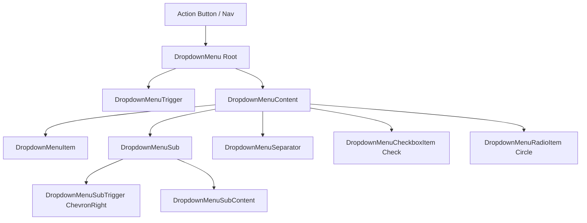

# Community 371 PRD — dropdown-menu.tsx

## Master Goal Mapping
Context menus, action menus, and navigation dropdowns throughout ALDECI.

## Architecture Diagram


## Code Proof
`suite-ui/aldeci-ui-new/src/components/ui/dropdown-menu.tsx:16-22`
```tsx
const DropdownMenuSubTrigger = forwardRef(({ inset, children, ...props }, ref) => (
  <DropdownMenuPrimitive.SubTrigger className={cn("flex cursor-default select-none items-center rounded-sm px-2 py-1.5 text-sm")}>
    {children}<ChevronRight className="ml-auto h-4 w-4" />
  </DropdownMenuPrimitive.SubTrigger>
));
```

## Inter-Dependencies
- **Imports**: `@radix-ui/react-dropdown-menu`, `Check/ChevronRight/Circle` from `lucide-react`, `cn`
- **Consumers**: TopNav user menu, table row actions, bulk action menus, export menus

## Data Flow
Menu items trigger callbacks / mutations in parent. Portaled outside DOM flow.

## Acceptance Criteria
- [ ] 15+ exports all functional
- [ ] SubTrigger shows ChevronRight indicator
- [ ] CheckboxItem renders Check icon when checked
- [ ] Keyboard navigation (arrow keys, Enter, ESC)

## Effort Estimate
Already implemented. **0 SP**

## Status
DONE — production ready
