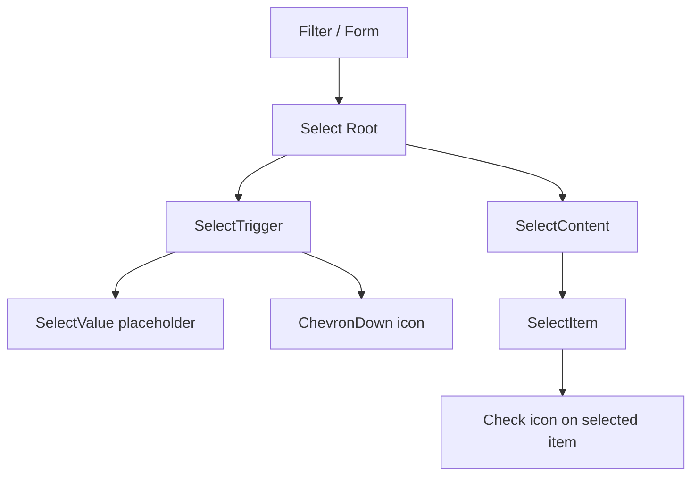

# Community 372 PRD — select.tsx

## Master Goal Mapping
Single-value select dropdowns for filters, severity pickers, framework selectors, and form fields.

## Architecture Diagram


## Code Proof
`suite-ui/aldeci-ui-new/src/components/ui/select.tsx:10-25`
```tsx
const SelectTrigger = forwardRef(({ className, children, ...props }, ref) => (
  <SelectPrimitive.Trigger
    className={cn("flex h-9 w-full items-center justify-between gap-2 rounded-lg border border-input bg-background px-3 py-2 text-sm")}
  >
    {children}
    <SelectPrimitive.Icon asChild><ChevronDown className="h-4 w-4 opacity-50" /></SelectPrimitive.Icon>
  </SelectPrimitive.Trigger>
));
```

## Inter-Dependencies
- **Imports**: `@radix-ui/react-select`, `Check/ChevronDown` from `lucide-react`, `cn`
- **Consumers**: Framework filter (SOC2/PCI/ISO27001), severity filter, time range picker, org selector

## Data Flow
`value` / `onValueChange` controlled. Selected value filters API query params.

## Acceptance Criteria
- [ ] `h-9 rounded-lg` trigger dimensions
- [ ] Check icon on currently selected item in dropdown
- [ ] ChevronDown rotates on open (CSS data-state)
- [ ] Keyboard navigation and search supported

## Effort Estimate
Already implemented. **0 SP**

## Status
DONE — production ready
