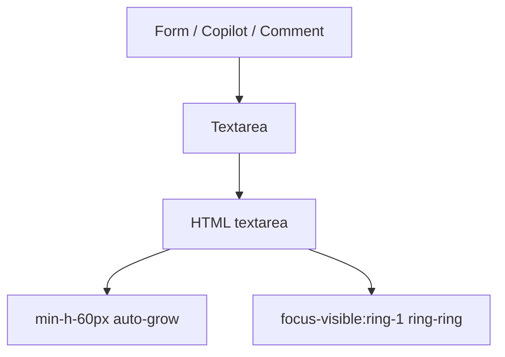

# Community 373 PRD — textarea.tsx

## Master Goal Mapping
Multi-line text input for incident descriptions, playbook notes, comment threads, and copilot chat input.

## Architecture Diagram


## Code Proof
`suite-ui/aldeci-ui-new/src/components/ui/textarea.tsx:4-13`
```tsx
const Textarea = forwardRef(({ className, ...props }, ref) => (
  <textarea
    className={cn("flex min-h-[60px] w-full rounded-md border border-input bg-transparent px-3 py-2 text-sm shadow-sm placeholder:text-muted-foreground focus-visible:outline-none focus-visible:ring-1 focus-visible:ring-ring disabled:cursor-not-allowed disabled:opacity-50")}
    ref={ref} {...props}
  />
));
```

## Inter-Dependencies
- **Imports**: `cn`
- **Consumers**: Incident description form, playbook step notes, vuln exception rationale, copilot chat input

## Data Flow
Controlled via `value` / `onChange`. Content submitted to mutation API on form submit.

## Acceptance Criteria
- [ ] `min-h-[60px]` minimum height
- [ ] `focus-visible:ring-1 ring-ring` focus indicator
- [ ] `disabled:opacity-50` when read-only
- [ ] `placeholder:text-muted-foreground` styled placeholder

## Effort Estimate
Already implemented. **0 SP**

## Status
DONE — production ready
