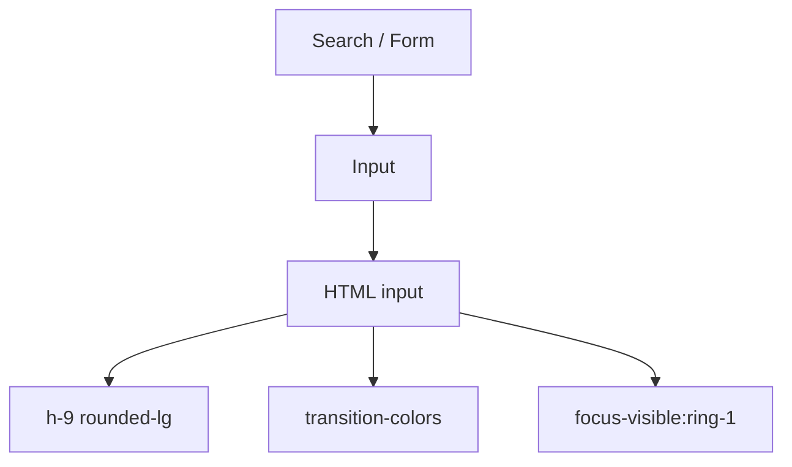

# Community 374 PRD — input.tsx

## Master Goal Mapping
Single-line text inputs for search, form fields, API key entry, and filter controls.

## Architecture Diagram


## Code Proof
`suite-ui/aldeci-ui-new/src/components/ui/input.tsx:5-15`
```tsx
const Input = forwardRef(({ className, type, ...props }, ref) => (
  <input type={type}
    className={cn("flex h-9 w-full rounded-lg border border-input bg-background px-3 py-1 text-sm shadow-sm transition-colors ... focus-visible:ring-1 focus-visible:ring-ring disabled:cursor-not-allowed disabled:opacity-50")}
    ref={ref} {...props}
  />
));
```

## Inter-Dependencies
- **Imports**: `cn`
- **Consumers**: Global search, IOC search, IP lookup, API key settings, login form, filter inputs

## Data Flow
Controlled or uncontrolled. On change → debounced search query or form state update.

## Acceptance Criteria
- [ ] `h-9 rounded-lg` dimensions (vs legacy h-10)
- [ ] `transition-colors` smooth border color change on focus
- [ ] `file:` variants styled for file upload inputs
- [ ] `focus-visible:ring-1` visible focus for accessibility

## Effort Estimate
Already implemented. **0 SP**

## Status
DONE — production ready
