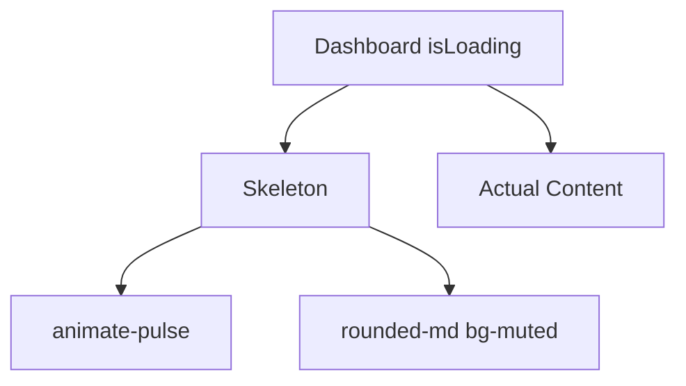

# Community 375 PRD — skeleton.tsx

## Master Goal Mapping
Loading placeholder shimmer for all async data areas, preventing layout shift during API fetches.

## Architecture Diagram


## Code Proof
`suite-ui/aldeci-ui-new/src/components/ui/skeleton.tsx:3-5`
```tsx
function Skeleton({ className, ...props }: React.HTMLAttributes<HTMLDivElement>) {
  return <div className={cn("animate-pulse rounded-md bg-muted", className)} {...props} />;
}
```

## Inter-Dependencies
- **Imports**: `cn`
- **Consumers**: PageSkeleton, card loading states, table row placeholders, metric value placeholders

## Data Flow
Rendered when `isLoading=true` from React Query. Replaced by actual content when data resolves.

## Acceptance Criteria
- [ ] `animate-pulse` CSS animation active
- [ ] `bg-muted` uses theme token (dark/light adaptive)
- [ ] `rounded-md` consistent with card radius
- [ ] Arbitrary `className` for width/height customisation

## Effort Estimate
Already implemented. **0 SP**

## Status
DONE — production ready
