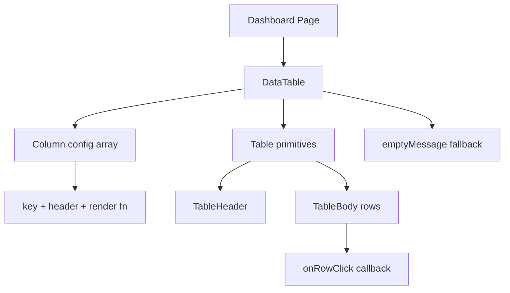

# Community 376 PRD — data-table.tsx

## Master Goal Mapping
Generic typed table component used across 50+ dashboard pages for CVE tables, finding tables, asset lists, and audit logs.

## Architecture Diagram


## Code Proof
`suite-ui/aldeci-ui-new/src/components/shared/data-table.tsx:3-20`
```tsx
interface Column<T> {
  key: string; header: string;
  render?: (row: T) => React.ReactNode;
  className?: string;
}
export function DataTable<T extends Record<string, unknown>>({
  columns, data, onRowClick, emptyMessage = "No data available", className,
}: DataTableProps<T>) { ... }
```

## Inter-Dependencies
- **Imports**: `cn`, Table primitives from `@/components/ui/table`
- **Consumers**: CVE tables, finding tables, audit logs, asset lists, IOC tables — all 50+ pages using tabular data

## Data Flow
`data: T[]` from React Query → column `render` fn transforms values → Table DOM. `onRowClick` → detail dialog or navigation.

## Acceptance Criteria
- [ ] Generic `<T>` type parameter enforced
- [ ] `render` fn overrides default `row[col.key]` display
- [ ] `onRowClick` triggers on row click
- [ ] Empty state message shown when `data.length === 0`
- [ ] `overflow-auto rounded-lg border border-border/50` wrapper

## Effort Estimate
Already implemented. **0 SP**

## Status
DONE — production ready
