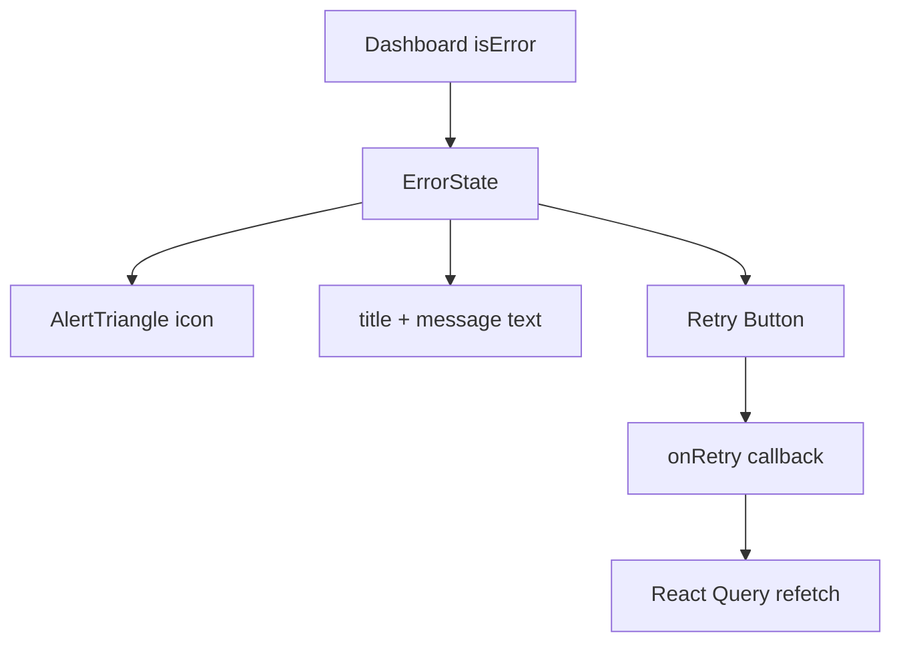

# Community 377 PRD — ErrorState.tsx

## Master Goal Mapping
Standardised error UI for all failed API calls across ALDECI dashboards, with optional retry action.

## Architecture Diagram


## Code Proof
`suite-ui/aldeci-ui-new/src/components/shared/ErrorState.tsx:1-30`
```tsx
export function ErrorState({ title = "Failed to load data", message, onRetry }) {
  return (
    <div className="flex flex-col items-center justify-center gap-4 py-16 text-center">
      <div className="rounded-xl bg-destructive/10 p-4">
        <AlertTriangle className="h-8 w-8 text-destructive" />
      </div>
      {onRetry && <Button variant="outline" size="sm" onClick={onRetry}><RefreshCw /> Retry</Button>}
    </div>
  );
}
```

## Inter-Dependencies
- **Imports**: `AlertTriangle`, `RefreshCw` from `lucide-react`; `Button` from `@/components/ui/button`
- **Consumers**: All 296+ dashboard pages — rendered in `isError` branch of React Query

## Data Flow
`onRetry` → `refetch()` from `useQuery`. No direct API call from ErrorState itself.

## Acceptance Criteria
- [ ] `py-16 text-center` centered layout
- [ ] `bg-destructive/10` icon background
- [ ] Retry button only renders when `onRetry` prop provided
- [ ] Default title "Failed to load data" when not specified
- [ ] `max-w-md` message text wrapping

## Effort Estimate
Already implemented. **0 SP**

## Status
DONE — production ready
