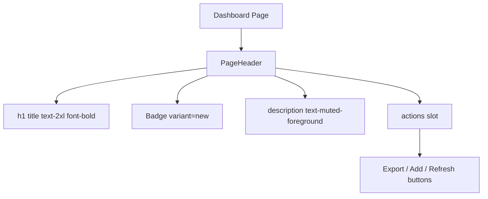

# Community 378 PRD — page-header.tsx

## Master Goal Mapping
Consistent page title/description/badge/actions header for all 296+ ALDECI dashboard pages.

## Architecture Diagram


## Code Proof
`suite-ui/aldeci-ui-new/src/components/shared/page-header.tsx:10-26`
```tsx
export function PageHeader({ title, description, badge, actions, children, className }) {
  return (
    <div className={cn("flex items-start justify-between gap-6", className)}>
      <div className="space-y-1.5 min-w-0 flex-1">
        <div className="flex items-center gap-3">
          <h1 className="text-2xl font-bold tracking-tight">{title}</h1>
          {badge && <Badge variant="new">{badge}</Badge>}
        </div>
        {description && <p className="text-sm text-muted-foreground leading-relaxed">{description}</p>}
      </div>
      {actionContent && <div className="flex items-center gap-2 shrink-0">{actionContent}</div>}
    </div>
  );
}
```

## Inter-Dependencies
- **Imports**: `cn`, `Badge` from `@/components/ui/badge`
- **Consumers**: All 296+ dashboard pages — top-of-page standard header

## Data Flow
Pure presentational. `title` and `badge` from static page definition. `actions` from page-level state.

## Acceptance Criteria
- [ ] `text-2xl font-bold tracking-tight` h1 title
- [ ] `badge` renders as `<Badge variant="new">` when provided
- [ ] `description` renders as `text-sm text-muted-foreground`
- [ ] `actions` / `children` render right-aligned shrink-0

## Effort Estimate
Already implemented. **0 SP**

## Status
DONE — production ready
