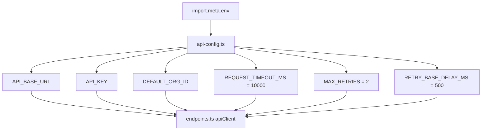

# Community 379 PRD — api-config.ts

## Master Goal Mapping
Single source of truth for all API client configuration: base URL, API key, org ID, timeouts, and retry policy.

## Architecture Diagram


## Code Proof
`suite-ui/aldeci-ui-new/src/lib/api-config.ts:10-26`
```ts
export const API_BASE_URL: string =
  (import.meta.env.VITE_API_URL as string | undefined)?.trim() || "http://localhost:8000";
export const API_KEY: string =
  (import.meta.env.VITE_API_KEY as string | undefined)?.trim() || "";
export const DEFAULT_ORG_ID: string =
  (import.meta.env.VITE_ORG_ID as string | undefined)?.trim() || "default";
export const REQUEST_TIMEOUT_MS = 10_000;
export const MAX_RETRIES = 2;
export const RETRY_BASE_DELAY_MS = 500;
```

## Inter-Dependencies
- **Imports**: `import.meta.env` (Vite)
- **Consumers**: `endpoints.ts`, all API client factory calls, `apiClient` wrapper

## Data Flow
Build-time: Vite injects `VITE_API_URL`, `VITE_API_KEY`, `VITE_ORG_ID` from `.env.*` files.
Runtime: constants exported to all API consumers.

## Referenced Docs
- `.env.example` in `suite-ui/aldeci-ui-new/`
- `vite.config.ts` — `envPrefix: ["VITE_"]`

## Acceptance Criteria
- [ ] `API_BASE_URL` defaults to `http://localhost:8000` when env not set
- [ ] `REQUEST_TIMEOUT_MS = 10_000` (10 seconds)
- [ ] `MAX_RETRIES = 2` for exponential back-off
- [ ] `RETRY_BASE_DELAY_MS = 500` base delay
- [ ] All constants typed (no `any`)

## Effort Estimate
Already implemented. **0 SP**

## Status
DONE — production ready
