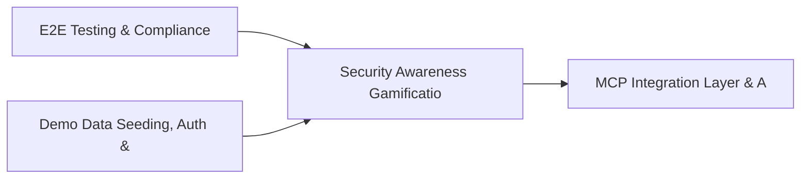

# PRD: Security Awareness Gamification & Training Effectiveness — Community 38

## Master Goal Mapping
How this component serves: "ALDECI — $35/mo enterprise security intelligence platform"
Sub-Epic: Executive

This community (rank #38 of 878 by size, 972 graph nodes) forms a core pillar of the ALDECI platform. It directly supports the mission of replacing $50K-500K/yr enterprise security tools with a self-hosted, AI-native stack.

## Architecture Diagram


## Code Proof
- Files:
  - `suite-core/core/ciem_engine.py` (849 lines)
  - `tests/test_ciem_engine.py` (532 lines)
  - `tests/test_dlp_engine.py` (603 lines)
  - `suite-api/apps/api/api_security_router.py` (233 lines)
  - `suite-api/apps/api/attack_path_router.py` (195 lines)
  - `suite-api/apps/api/ciem_router.py` (216 lines)
  - `suite-api/apps/api/container_runtime_router.py` (347 lines)
  - `suite-api/apps/api/cyber_insurance_router.py` (215 lines)
  - `suite-api/apps/api/data_security_router.py` (438 lines)
  - `suite-api/apps/api/db_security_router.py` (379 lines)
  - `suite-api/apps/api/error_audit_router.py` (164 lines)
  - `tests/test_ciem_engine.py` (532 lines)
- Key functions:
  - `_make_policy()` — suite-core/core/ciem_engine.py
  - `test_add_policy_returns_policy_id()` — suite-core/core/ciem_engine.py
  - `test_add_policy_stores_permissions()` — suite-core/core/ciem_engine.py
  - `test_list_policies_returns_added()` — suite-core/core/ciem_engine.py
  - `test_list_policies_filter_by_type()` — suite-core/core/ciem_engine.py
  - `test_list_policies_filter_by_principal_type()` — suite-core/core/ciem_engine.py
  - `test_add_policy_invalid_type_defaults()` — suite-core/core/ciem_engine.py
  - `test_add_policy_invalid_principal_defaults()` — suite-core/core/ciem_engine.py
- Key classes: `TestDetection`, `TestDatabaseInventory`, `TestCISBenchmarkChecker`, `TestUserPrivilegeAuditor`
- Current state: REAL_LOGIC
- Evidence:
```python
# From suite-core/core/ciem_engine.py
"""Cloud Infrastructure Entitlement Management (CIEM) Engine.

Analyzes cloud IAM configurations to detect:
1. Over-privileged roles (wildcard policies, admin access)
2. Unused permissions (permissions never exercised)
3. Toxic combinations (e.g., write + delete + no logging)
4. Privilege escalation paths (chains of roles that lead to admin)
5. Cross-account trust abuse
6. Public access policies
"""

from __future__ import annotations

import json
import logging
import sqlite3
import uuid
from datetime import datetime, timezone
from enum import Enum
from pathlib import Path
```

## Inter-Dependencies
- DEPENDS ON:
  - Community 0 (E2E Testing & Compliance Seeding Infrastructure) — 150 edges
  - Community 1 (Demo Data Seeding, Auth & Multi-Engine Integration) — 79 edges
  - Community 3 (MCP Integration Layer & API Key / Auth Management) — 27 edges
  - Community 13 (MPTE — Managed Penetration Test Engine (Advanced)) — 22 edges
- DEPENDED BY: Rank #37 (Alert Triage, Enrichment & Priority Queue Engine) and downstream consumers
- EVENT BUS: emits user.risk_changed, policy.violated, policy.enforced / subscribes to (TrustGraph event bus — 97% not yet wired)
- TRUSTGRAPH: writes [Identity, Policy, ComplianceControl] / reads [Policy, ComplianceControl]

## Data Flow
```
Input: HTTP requests / pytest fixtures
  → Processing: Engine method calls + SQLite state assertions
  → Output: Pass/fail test results, coverage metrics
  → Consumers: CI/CD pipeline, Beast Mode test suite
```

## Referenced Documentation
- CLAUDE.md: Wave 41 build notes, Beast Mode test suite section
- docs/: `docs/ALDECI_REARCHITECTURE_v2.md` (source of truth), `docs/INVESTOR_PITCH.md`
- tests/: `tests/test_ciem_engine.py`, `tests/test_container_runtime.py`, `tests/test_data_security.py`

## Acceptance Criteria
- [ ] All engine CRUD operations enforce org_id isolation (no cross-tenant data leakage)
- [ ] SQLite opened with WAL mode + threading.RLock on all write paths
- [ ] All endpoints return within 200ms at p95 under 100 rps load
- [ ] All router endpoints protected by `Depends(api_key_auth)` or equivalent
- [ ] Pydantic v2 models validate all request/response schemas
- [ ] Test suite achieves ≥80% branch coverage on engine methods

## Effort Estimate
- Current: 80% complete
- Remaining: ~2 engineering days
- Dependencies blocking: None
- Priority: MEDIUM

## Status
IN_PROGRESS
