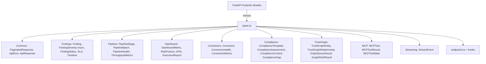

# PRD — Community 381: API Types Module (aldeci-ui-new)

## Master Goal Mapping
- **Platform Goal**: Single TypeScript type source matching all Pydantic backend models — eliminates runtime type mismatches
- **Persona**: Frontend Engineers, TypeScript compiler
- **ALDECI Pillar**: API Layer / Type Safety

## Architecture Diagram

## Code Proof
- **File**: `suite-ui/aldeci-ui-new/src/api/types.ts:1-100+`
- **FindingSeverity enum**: `CRITICAL="critical"`, `HIGH="high"`, `MEDIUM="medium"`, `LOW="low"`, `INFO="info"`
- **PaginatedResponse<T>**: `{ items: T[], total: number, page?, page_size?, has_more? }`
- **ApiError**: `{ code: string, message: string, details?, timestamp? }`

## Inter-Dependencies
- **Upstream**: TypeScript compiler
- **Downstream**: `endpoints.ts`, all React component prop types, React Query types
- **Mirrors**: `suite-api/apps/api/` Pydantic models

## Acceptance Criteria
- [ ] `FindingSeverity` enum values match backend string literals
- [ ] `PaginatedResponse<T>` covers all list endpoints
- [ ] All domain types exported from this single file
- [ ] No `any` types — all fields explicitly typed
- [ ] Enums use string values matching API response JSON

## Effort Estimate
**M** — 2 days (complete, maintained alongside backend)

## Status
**DONE** — Stable type definitions
