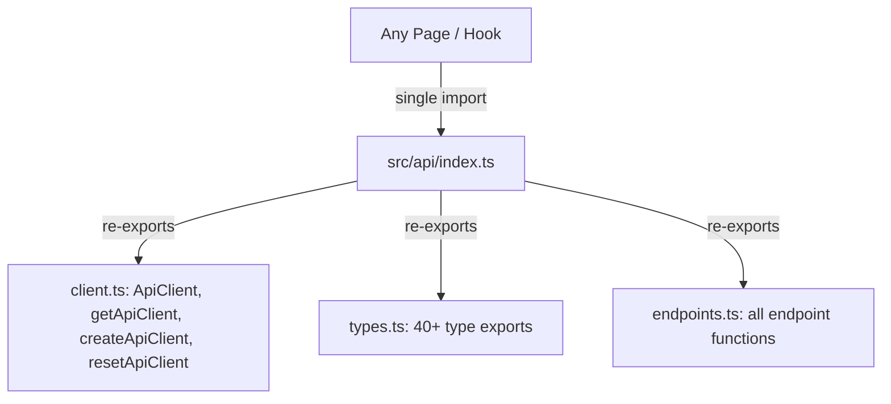

# PRD — Community 382: API Module Index (aldeci-ui-new)

## Master Goal Mapping
- **Platform Goal**: Clean re-export barrel for all API client, types, endpoints, and hooks — single import point
- **Persona**: Frontend Engineers — `import { getFindings, Finding } from '@/api'`
- **ALDECI Pillar**: API Layer / Developer Experience

## Architecture Diagram

## Code Proof
- **File**: `suite-ui/aldeci-ui-new/src/api/index.ts:1-80+`
- **Pattern**: Barrel file — `export { ... } from './client'`, `export type { ... } from './types'`, `export { ... } from './endpoints'`
- **Client exports**: `ApiClient`, `getApiClient`, `createApiClient`, `resetApiClient`
- **Type re-exports**: All types from `types.ts` with `export type` syntax

## Inter-Dependencies
- **Upstream**: `./client`, `./types`, `./endpoints`
- **Downstream**: All pages and hooks import from `@/api` alias

## Acceptance Criteria
- [ ] All client functions re-exported
- [ ] All types re-exported with `export type`
- [ ] All endpoint functions re-exported
- [ ] No circular dependencies
- [ ] Tree-shakeable (named exports only)

## Effort Estimate
**XS** — 0.25 days (complete)

## Status
**DONE** — Stable barrel export
