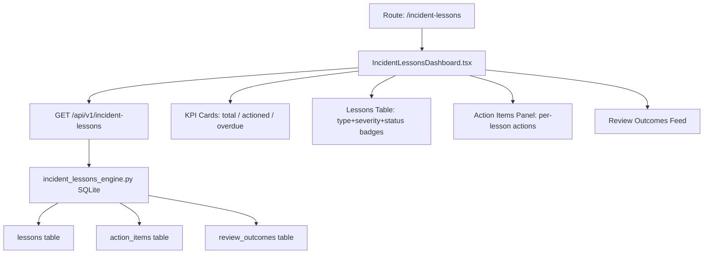

# PRD — Community 383: Incident Lessons Learned Dashboard

## Master Goal Mapping
- **Platform Goal**: Track post-incident knowledge capture — lessons, action items, implementation progress
- **Persona**: Incident Commander, SOC Manager, CISO
- **ALDECI Pillar**: Incident Response / Continuous Improvement
- **Backend Engine**: `suite-core/core/incident_lessons_engine.py`

## Architecture Diagram


## Code Proof
- **File**: `suite-ui/aldeci-ui-new/src/pages/IncidentLessonsDashboard.tsx:1-60+`
- **Types**: `LessonType` (6), `LessonSeverity` (4), `LessonStatus` (4: identified/under_review/actioned/closed), `ActionStatus` (4: open/in_progress/completed/overdue)
- **Key interface**: `Lesson { id, title, incident_ref, lesson_type, severity, status, identified_by, identified_date, implementation_rate }`
- **API route**: `GET /api/v1/incident-lessons`

## Inter-Dependencies
- **Backend**: `incident_lessons_engine.py` — auto-promotes to `implemented` when all actions complete
- **Router**: `suite-api/apps/api/incident_lessons_router.py`
- **UI deps**: `Badge`, `Table`, `PageHeader`, `Card`
- **Related**: Incident Orchestration engine, SLA engine

## Data Flow
```
Page load → GET /api/v1/incident-lessons →
{ lessons[], action_items[], review_outcomes[] } →
lessons table rendered → select lesson → action items panel updates →
implementation_rate bar shows % of actions completed
```

## Referenced Docs
- Engine: `suite-core/core/incident_lessons_engine.py`
- 48 tests: `tests/test_incident_lessons_engine.py`

## Acceptance Criteria
- [ ] Lessons table shows type/severity/status badges
- [ ] `implementation_rate` progress bar per lesson
- [ ] Action items panel filters by selected lesson
- [ ] Overdue actions highlighted in red
- [ ] Review outcomes feed chronological
- [ ] API error falls back to mock data

## Effort Estimate
**M** — 2 days (complete)

## Status
**DONE** — Production dashboard, wired to live API
