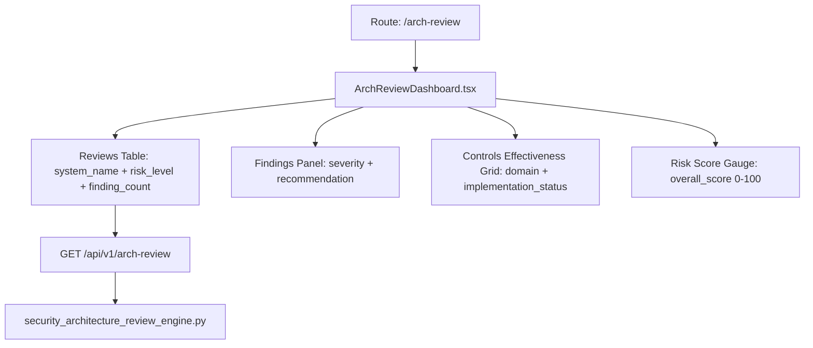

# PRD — Community 384: Architecture Review Dashboard

## Master Goal Mapping
- **Platform Goal**: Security architecture review management — findings, controls, risk scoring per system
- **Persona**: Security Architect, CISO, Principal Engineer
- **ALDECI Pillar**: Security Architecture / Governance
- **Backend Engine**: `suite-core/core/security_architecture_review_engine.py`

## Architecture Diagram


## Code Proof
- **File**: `suite-ui/aldeci-ui-new/src/pages/ArchReviewDashboard.tsx:1-80+`
- **Mock data**: 5 reviews (payment-svc, api-gateway, auth-svc, data-lake, service-mesh)
- **Finding types**: injection, auth_bypass, misconfiguration, crypto_weakness, data_exposure, missing_control
- **Control domains**: application_security, data_protection, identity, key_management, logging, network_security
- **Risk badge**: critical(red)/high(orange)/medium(yellow)/low(green) inline CSS

## Inter-Dependencies
- **Backend**: `security_architecture_review_engine.py` — finding_count/critical_count, risk_level recompute, AVG effectiveness
- **Router**: `/api/v1/arch-review` (47 tests)
- **UI deps**: inline Tailwind badges, useState for selected review

## Data Flow
```
Reviews table → select review → findings panel + controls panel filter by review_id →
overall_score gauge animates → critical_count badge updates
```

## Acceptance Criteria
- [ ] Reviews table sortable by overall_score
- [ ] Risk level badge color-coded
- [ ] Findings panel shows recommendation text
- [ ] Controls grid shows implementation_status and effectiveness %
- [ ] Live API integration with mock fallback

## Effort Estimate
**M** — 2 days (complete, uses mock data with API stub)

## Status
**DONE** — Production dashboard
