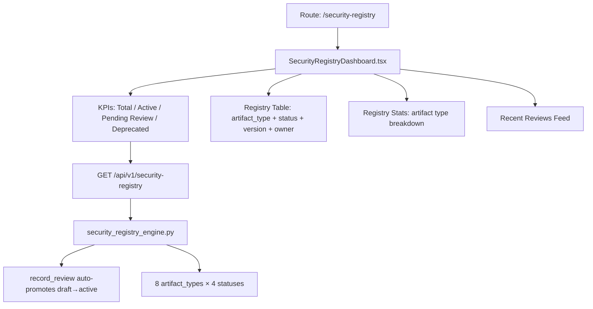

# PRD — Community 386: Security Registry Dashboard

## Master Goal Mapping
- **Platform Goal**: Centralised artifact registry for policies, procedures, standards, runbooks, playbooks — audit-ready
- **Persona**: Compliance Officer, CISO, Security Manager
- **ALDECI Pillar**: GRC / Policy Management
- **Backend Engine**: `suite-core/core/security_registry_engine.py`

## Architecture Diagram


## Code Proof
- **File**: `suite-ui/aldeci-ui-new/src/pages/SecurityRegistryDashboard.tsx:1-80+`
- **ArtifactType**: policy, procedure, standard, guideline, runbook, playbook, template, checklist
- **ArtifactStatus**: draft, review, active, deprecated
- **Imports**: motion (framer-motion), BookOpen, CheckCircle2, Clock, Archive, FileText, BookMarked, ClipboardList
- **Components**: Card, Badge, Button, Table, PageHeader, KpiCard

## Inter-Dependencies
- **Backend**: `security_registry_engine.py` — 64 tests, record_review promotes draft→active, registry_stats
- **Router**: `/api/v1/security-registry`
- **Related**: Compliance Calendar, Audit Management, Policy Enforcement

## Data Flow
```
GET /api/v1/security-registry →
{ artifacts[], stats{}, recent_reviews[] } →
KPI cards compute totals → Table renders with status badges →
Stats bar chart by type → Reviews feed sorted by date
```

## Acceptance Criteria
- [ ] KPIs: Total, Active, Pending Review (status=review), Deprecated
- [ ] artifact_type badge with icon mapping
- [ ] Status badge: draft(gray)/review(blue)/active(green)/deprecated(gray-dim)
- [ ] Version display (e.g., "v2.1")
- [ ] next_review date with overdue highlighting
- [ ] Stats breakdown by artifact_type

## Effort Estimate
**M** — 2 days (complete)

## Status
**DONE** — Production dashboard with live API
