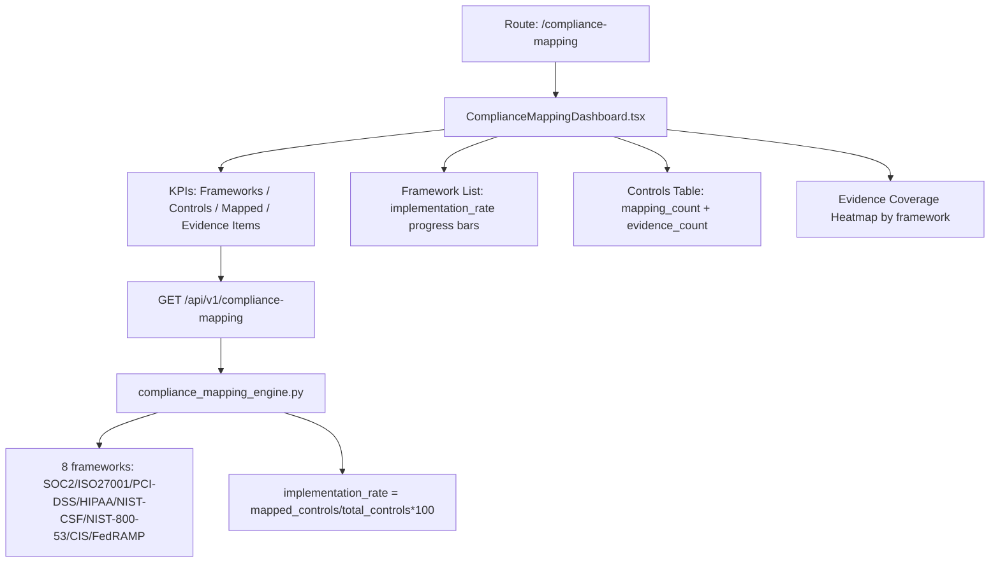

# PRD — Community 387: Compliance Mapping Dashboard

## Master Goal Mapping
- **Platform Goal**: Framework control mapping, implementation rates, and evidence coverage across 8+ compliance frameworks
- **Persona**: Compliance Officer, CISO, Auditor
- **ALDECI Pillar**: GRC / Compliance Automation
- **Backend Engine**: `suite-core/core/compliance_mapping_engine.py`

## Architecture Diagram


## Code Proof
- **File**: `suite-ui/aldeci-ui-new/src/pages/ComplianceMappingDashboard.tsx:1-80+`
- **Framework interface**: `{ id, name, version, total_controls, mapped_controls, implementation_rate, evidence_count, status }`
- **Control interface**: `{ id, framework_id, control_id, control_name, domain, implementation_status, mapping_count, evidence_count }`
- **Status**: compliant/partial/non_compliant
- **Imports**: motion, Shield, FileCheck, Link2, BarChart2

## Inter-Dependencies
- **Backend**: `compliance_mapping_engine.py` — 47 tests, implementation_rate auto-computed
- **Router**: `/api/v1/compliance-mapping`
- **Related**: ComplianceCalendar, GapAnalysis, ComplianceAutomation, ComplianceWorkflow

## Data Flow
```
GET /api/v1/compliance-mapping →
{ frameworks[], controls[], evidence[] } →
Framework list with progress bars →
Select framework → controls table filtered →
Evidence count heatmap rendered
```

## Acceptance Criteria
- [ ] 8 frameworks displayed with implementation_rate progress bars
- [ ] Status badge: compliant(green)/partial(yellow)/non_compliant(red)
- [ ] Controls table filterable by framework
- [ ] Evidence count displayed per framework and control
- [ ] KPIs compute from API data

## Effort Estimate
**M** — 2 days (complete)

## Status
**DONE** — Production dashboard with live API
