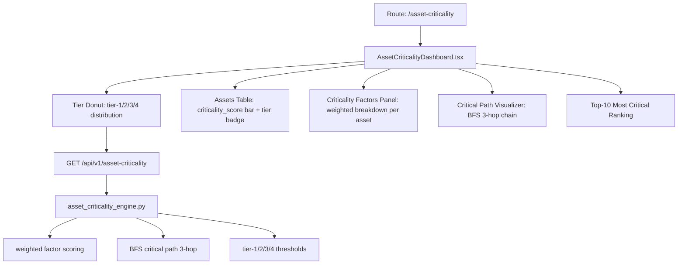

# PRD — Community 388: Asset Criticality Dashboard

## Master Goal Mapping
- **Platform Goal**: Asset criticality scoring with tier distribution, weighted factor analysis, and BFS critical path
- **Persona**: Security Architect, Asset Owner, Risk Manager
- **ALDECI Pillar**: Asset Management / Risk Quantification
- **Backend Engine**: `suite-core/core/asset_criticality_engine.py`

## Architecture Diagram


## Code Proof
- **File**: `suite-ui/aldeci-ui-new/src/pages/AssetCriticalityDashboard.tsx:1-80+`
- **Tier type**: `"tier-1-critical" | "tier-2-high" | "tier-3-medium" | "tier-4-low"`
- **Asset types**: server, database, api, network, endpoint, cloud, iot
- **Environment**: production/staging/dev
- **Icons**: Server, AlertTriangle, GitBranch (BFS), Trophy (top-10)

## Inter-Dependencies
- **Backend**: `asset_criticality_engine.py` — 41 tests, BFS critical path, tier thresholds
- **Router**: `/api/v1/asset-criticality`
- **Related**: AssetGroups, AssetTagging, DependencyMapping, RiskRegister

## Data Flow
```
GET /api/v1/asset-criticality →
Tier donut computes distribution →
Select asset → factors panel shows weighted breakdown →
BFS chain shows 3-hop critical path →
Top-10 sorted by criticality_score desc
```

## Acceptance Criteria
- [ ] Tier donut shows 4 tier counts
- [ ] criticality_score 0-100 bar per asset
- [ ] Factors panel shows each factor with weight and contribution
- [ ] BFS path shows hop chain (A → B → C)
- [ ] Top-10 ranking with rank numbers
- [ ] Environment badge (prod/staging/dev)

## Effort Estimate
**M** — 2.5 days (complete)

## Status
**DONE** — Production dashboard
