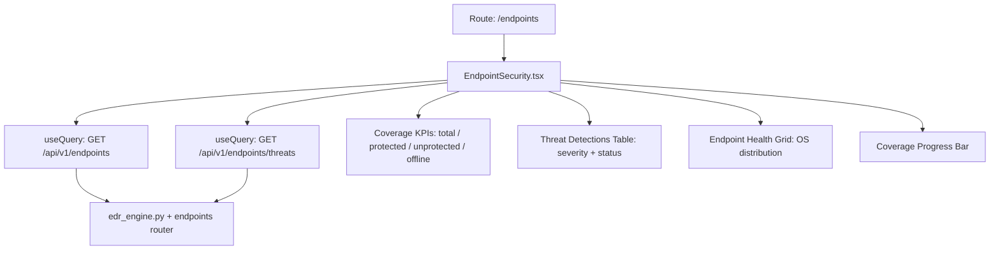

# PRD — Community 389: Endpoint Security / EDR Dashboard

## Master Goal Mapping
- **Platform Goal**: EDR coverage monitoring, threat detection display, and endpoint health dashboard
- **Persona**: SOC Analyst T1/T2, Endpoint Security Engineer
- **ALDECI Pillar**: Endpoint Security / EDR
- **Backend Engines**: `edr_engine.py`, existing `/api/v1/endpoints` route

## Architecture Diagram


## Code Proof
- **File**: `suite-ui/aldeci-ui-new/src/pages/EndpointSecurity.tsx:1-60+`
- **Data fetching**: `@tanstack/react-query` `useQuery` (live API, not mock)
- **Imports**: motion, AlertTriangle, Shield, Monitor, Activity, CheckCircle2, XCircle, Clock, Wifi, WifiOff
- **Components**: Card, Badge, Button, Progress (from ui/)

## Inter-Dependencies
- **Backend**: `edr_engine.py` — 31 tests; `/api/v1/endpoints` router
- **UI deps**: `@tanstack/react-query`, framer-motion, Progress component
- **Related**: NetworkMonitoring, UBA, PrivilegedIdentity, InsiderThreat

## Data Flow
```
useQuery(['endpoints']) → GET /api/v1/endpoints → endpoint list →
Coverage % = protected/total → Progress bar →
useQuery(['threats']) → GET /api/v1/endpoints/threats → threat table →
isLoading → Skeleton; isError → ErrorState + retry
```

## Acceptance Criteria
- [ ] Live API integration via useQuery (not mock)
- [ ] Loading skeleton while fetching
- [ ] ErrorState with retry button on API failure
- [ ] Coverage progress bar with %
- [ ] Threat table with severity badges
- [ ] Online/offline status indicators (Wifi/WifiOff icons)

## Effort Estimate
**M** — 2 days (complete, live API)

## Status
**DONE** — Production dashboard with live API integration
