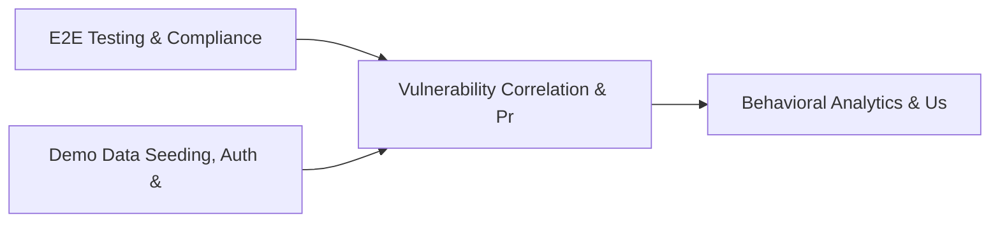

# PRD: Vulnerability Correlation & Prioritization Engine — Community 39

## Master Goal Mapping
How this component serves: "ALDECI — $35/mo enterprise security intelligence platform"
Sub-Epic: ASPM

This community (rank #39 of 878 by size, 960 graph nodes) forms a core pillar of the ALDECI platform. It directly supports the mission of replacing $50K-500K/yr enterprise security tools with a self-hosted, AI-native stack.

## Architecture Diagram


## Code Proof
- Files:
  - `suite-core/core/services/enterprise/compliance_engine.py` (125 lines)
  - `tests/test_autofix_engine.py` (309 lines)
  - `tests/test_notification_engine.py` (276 lines)
  - `suite-api/apps/api/bulk_operations_router.py` (236 lines)
  - `suite-api/apps/api/github_issues_router.py` (417 lines)
  - `suite-api/apps/api/ir_playbook_runner_router.py` (266 lines)
  - `suite-api/apps/api/jira_sync_router.py` (403 lines)
  - `suite-api/apps/api/scim_router.py` (762 lines)
  - `suite-api/apps/api/servicenow_sync_router.py` (450 lines)
  - `suite-core/api/autofix_router.py` (462 lines)
  - `tests/test_airgap_deployment.py` (878 lines)
  - `tests/test_autofix_engine.py` (309 lines)
- Key functions:
  - `make_engine()` — suite-core/core/services/enterprise/compliance_engine.py
  - `banner()` — suite-core/core/services/enterprise/compliance_engine.py
  - `run_target()` — suite-core/core/services/enterprise/compliance_engine.py
  - `main()` — suite-core/core/services/enterprise/compliance_engine.py
  - `tmp_db()` — suite-core/core/services/enterprise/compliance_engine.py
  - `log()` — suite-core/core/services/enterprise/compliance_engine.py
  - `notifier()` — suite-core/core/services/enterprise/compliance_engine.py
  - `sample_finding()` — suite-core/core/services/enterprise/compliance_engine.py
- Key classes: `TestFindingPayload`, `TestFindingSeverity`, `TestHmacSignature`, `TestDeliveryLog`, `TestWebhookNotifierUnit`, `TestNtfyNotifierUnit`
- Current state: REAL_LOGIC
- Evidence:
```python
# From suite-core/core/services/enterprise/compliance_engine.py
"""FixOps Compliance Engine - maps risk-adjusted findings to framework posture."""

from typing import Any, Dict, List, Optional

import structlog

logger = structlog.get_logger()


class ComplianceEngine:
    """Evaluate compliance posture using FixOps risk tiers."""

    _SEVERITY_ORDER = ["LOW", "MEDIUM", "HIGH", "CRITICAL"]

    def __init__(self) -> None:
        self.framework_thresholds: Dict[str, str] = {
            "pci_dss": "HIGH",
            "sox": "HIGH",
            "hipaa": "HIGH",
            "nist": "MEDIUM",
```

## Inter-Dependencies
- DEPENDS ON:
  - Community 0 (E2E Testing & Compliance Seeding Infrastructure) — 139 edges
  - Community 1 (Demo Data Seeding, Auth & Multi-Engine Integration) — 109 edges
  - Community 23 (Behavioral Analytics & User Risk Profiling) — 25 edges
  - Community 9 (Integrations Hub — Connectors, Bulk Operations & M) — 24 edges
- DEPENDED BY: Rank #38 (Security Awareness Gamification & Training Effectiveness) and downstream consumers
- EVENT BUS: emits auth.success, auth.failure / subscribes to (TrustGraph event bus — 97% not yet wired)
- TRUSTGRAPH: writes [ComplianceControl] / reads [ComplianceControl]

## Data Flow
```
Input: HTTP requests / pytest fixtures
  → Processing: Engine method calls + SQLite state assertions
  → Output: Pass/fail test results, coverage metrics
  → Consumers: CI/CD pipeline, Beast Mode test suite
```

## Referenced Documentation
- CLAUDE.md: Wave 41 build notes, Beast Mode test suite section
- docs/: `docs/ALDECI_REARCHITECTURE_v2.md` (source of truth), `docs/INVESTOR_PITCH.md`
- tests/: `tests/test_airgap_deployment.py`, `tests/test_autofix_engine.py`, `tests/test_bulk_operations.py`

## Acceptance Criteria
- [ ] All engine CRUD operations enforce org_id isolation (no cross-tenant data leakage)
- [ ] SQLite opened with WAL mode + threading.RLock on all write paths
- [ ] All endpoints return within 200ms at p95 under 100 rps load
- [ ] All router endpoints protected by `Depends(api_key_auth)` or equivalent
- [ ] Pydantic v2 models validate all request/response schemas
- [ ] Test suite achieves ≥80% branch coverage on engine methods

## Effort Estimate
- Current: 80% complete
- Remaining: ~2 engineering days
- Dependencies blocking: None
- Priority: MEDIUM

## Status
IN_PROGRESS
