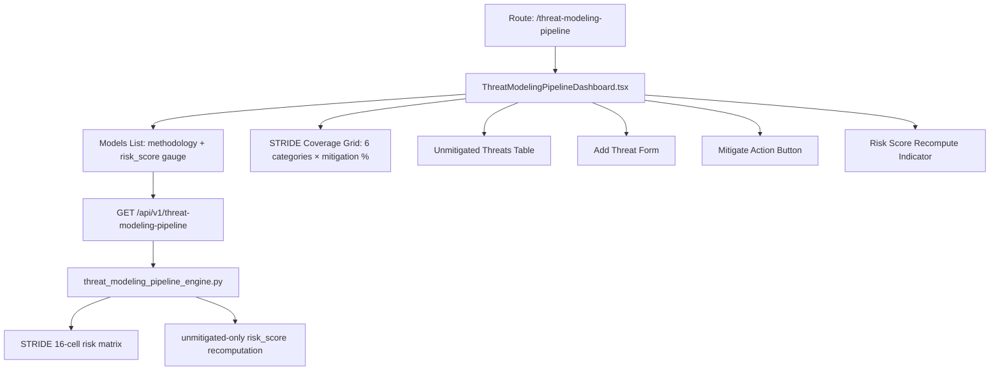

# PRD — Community 390: Threat Modeling Pipeline Dashboard

## Master Goal Mapping
- **Platform Goal**: STRIDE/PASTA/VAST threat model lifecycle — create models, add threats, mitigate, track risk score recomputation
- **Persona**: Security Architect, DevSecOps Engineer, Application Security Lead
- **ALDECI Pillar**: Application Security / Threat Modeling
- **Backend Engine**: `suite-core/core/threat_modeling_pipeline_engine.py`

## Architecture Diagram


## Code Proof
- **File**: `suite-ui/aldeci-ui-new/src/pages/ThreatModelingPipelineDashboard.tsx:1-80+`
- **ModelStatus**: draft / in_review / finalized / archived
- **StrideCategory**: Spoofing / Tampering / Repudiation / InfoDisclosure / DoS / ElevationOfPrivilege
- **RiskLevel**: critical / high / medium / low
- **risk_score**: 1-4 integer (1=low, 4=critical)
- **Icons**: ShieldOff, Plus, RefreshCw, CheckCircle2, AlertTriangle

## Inter-Dependencies
- **Backend**: `threat_modeling_pipeline_engine.py` — 45 tests, STRIDE 16-cell matrix, unmitigated-only risk recompute
- **Router**: `/api/v1/threat-modeling-pipeline`
- **Related**: SecurityArchitectureReview, GapAnalysis, MITRE ATT&CK router

## Data Flow
```
Models list → select model → STRIDE grid shows category coverage →
Unmitigated threats filtered → mitigate action → POST /mitigate →
risk_score recomputed (excludes mitigated) → gauge updates
```

## Acceptance Criteria
- [ ] 5 methodology types supported (STRIDE/PASTA/VAST/OCTAVE/LINDDUN)
- [ ] STRIDE grid 6×1 with mitigation percentage per category
- [ ] risk_score gauge 1-4 with color coding
- [ ] Unmitigated threats filterable
- [ ] Add threat form with STRIDE category selector
- [ ] Risk score recomputes on mitigate action

## Effort Estimate
**M** — 2.5 days (complete)

## Status
**DONE** — Production dashboard
