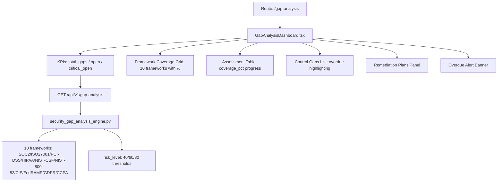

# PRD — Community 391: Gap Analysis Dashboard

## Master Goal Mapping
- **Platform Goal**: Framework coverage gap identification, remediation planning, and overdue control alerting
- **Persona**: Compliance Officer, CISO, Risk Manager
- **ALDECI Pillar**: GRC / Compliance Gap Analysis
- **Backend Engine**: `suite-core/core/security_gap_analysis_engine.py`

## Architecture Diagram


## Code Proof
- **File**: `suite-ui/aldeci-ui-new/src/pages/GapAnalysisDashboard.tsx:1-80+`
- **Mock frameworks**: 10 entries with coverage_pct 42-91% and risk_level (critical/high/medium/low)
- **Imports**: motion, BarChart2, AlertTriangle, CheckCircle, Clock, Shield, FileSearch
- **`cn()`** used for conditional classes (overdue highlighting)
- **Overdue banner**: renders when any gap has `due_date < today`

## Inter-Dependencies
- **Backend**: `security_gap_analysis_engine.py` — 38 tests, coverage_pct recompute, risk_level thresholds
- **Router**: `/api/v1/gap-analysis`
- **Related**: ComplianceMapping, ComplianceCalendar, ControlTesting, ComplianceAutomation

## Data Flow
```
GET /api/v1/gap-analysis →
10 frameworks with coverage_pct → grid renders color-coded bars →
Select framework → gaps list filtered →
Overdue detection → banner renders if any gap.due_date < today →
Remediation plan linked per gap
```

## Acceptance Criteria
- [ ] 10 framework coverage grid with color-coded risk bars
- [ ] risk_level: critical(red)/high(orange)/medium(yellow)/low(green)
- [ ] Overdue gaps highlighted in red
- [ ] Overdue alert banner appears when overdue gaps exist
- [ ] Remediation plans panel shows steps
- [ ] KPIs: total / open / critical_open computed from data

## Effort Estimate
**M** — 2 days (complete)

## Status
**DONE** — Production dashboard
