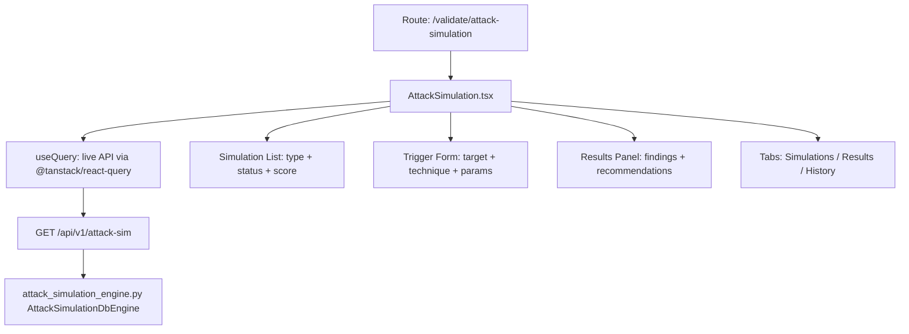

# PRD — Community 393: Attack Simulation Dashboard (aldeci-ui-new)

## Master Goal Mapping
- **Platform Goal**: Orchestrate attack simulations (red team exercises, breach scenarios) via the attack simulation engine
- **Persona**: Red Team Lead, Security Engineer, Penetration Tester
- **ALDECI Pillar**: Offensive Security / Validate Phase
- **Backend Engine**: `suite-core/core/attack_simulation_engine.py`

## Architecture Diagram


## Code Proof
- **File**: `suite-ui/aldeci-ui-new/src/pages/validate/AttackSimulation.tsx:1-50+`
- **Imports**: `toArray` from api-utils, Card, Badge, Button, Input, Label, Progress, Tabs, Dialog, Select
- **Pattern**: `useCallback` for form submission, Dialog for confirm modals
- **API**: `GET /api/v1/attack-sim` via live API

## Inter-Dependencies
- **Backend**: `attack_simulation_engine.py` — 31 tests, `AttackSimulationDbEngine`
- **Router**: `suite-api/apps/api/attack_simulation_router.py`
- **Related**: ThreatSimulation engine, SecurityTabletop, RedTeam management

## Data Flow
```
List simulations → select/create → trigger form fills params →
POST /api/v1/attack-sim/run → results stream back →
Findings displayed with severity + recommendation →
History tab shows past runs
```

## Acceptance Criteria
- [ ] Live API via useQuery (not static mock)
- [ ] Trigger form with target, technique, simulation_type
- [ ] Results panel shows finding count by severity
- [ ] Dialog confirmation before triggering simulation
- [ ] History tab shows past execution results
- [ ] Progress indicator during simulation run

## Effort Estimate
**M** — 2 days (complete)

## Status
**DONE** — Production page in validate/ section
