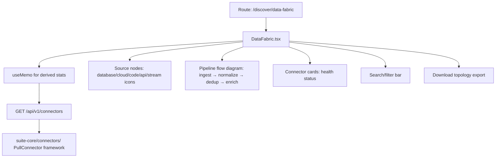

# PRD — Community 394: Data Fabric Page (aldeci-ui-new)

## Master Goal Mapping
- **Platform Goal**: Visualise the data ingestion fabric — connectors, pipelines, data sources, flow metrics
- **Persona**: Data Engineer, Security Architect, CTO
- **ALDECI Pillar**: Data Ingestion / CTEM Pipeline Stage 1
- **Backend**: Connector framework (`suite-core/connectors/`)

## Architecture Diagram


## Code Proof
- **File**: `suite-ui/aldeci-ui-new/src/pages/discover/DataFabric.tsx:1-50+`
- **Imports**: `toArray` from api-utils, useMemo, motion, Database, Cloud, Code, Package icons
- **Icons**: Database, RefreshCw, CheckCircle2, AlertTriangle, XCircle, Activity, GitBranch, Layers, ChevronRight/Down, Search, Download, Clock, Zap, BarChart2, ArrowLeftRight, FileJson, Shield, Cloud, Code, Package

## Inter-Dependencies
- **Backend**: Connector framework (13 PULL + 7 bidirectional connectors)
- **Related (legacy)**: `suite-ui/aldeci/src/pages/DataFabric.tsx` (frozen)
- **API**: `/api/v1/connectors`, `/api/v1/pipeline/health`

## Data Flow
```
GET /api/v1/connectors → source nodes rendered →
useMemo computes health stats → flow diagram animates →
Search filters connector list → Download exports topology JSON
```

## Acceptance Criteria
- [ ] All 20 connectors (13 PULL + 7 bidi) shown
- [ ] Health status indicators (green/yellow/red)
- [ ] Pipeline flow diagram: ingest→normalize→dedup→enrich→correlate→score→prioritize
- [ ] Search filters by connector name/type
- [ ] JSON topology export
- [ ] `toArray` prevents crash on non-array API responses

## Effort Estimate
**M** — 2 days (complete)

## Status
**DONE** — Production page
