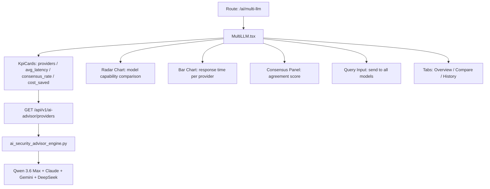

# PRD — Community 397: Multi-LLM Comparison Dashboard

## Master Goal Mapping
- **Platform Goal**: Karpathy consensus model — compare responses from 4+ LLM providers for security analysis
- **Persona**: Security Analyst, CISO, AI/ML Security Lead
- **ALDECI Pillar**: AI Intelligence / Karpathy LLM Consensus
- **Backend**: `suite-core/core/ai_security_advisor_engine.py`, brain pipeline LLM council

## Architecture Diagram


## Code Proof
- **File**: `suite-ui/aldeci-ui-new/src/pages/ai/MultiLLM.tsx:1-80+`
- **Charts**: BarChart, RadarChart from recharts; PolarGrid, PolarAngleAxis, PolarRadiusAxis, Radar, Legend
- **Icons**: Brain, Cpu, CheckCircle, AlertTriangle, Clock, Zap, MessageSquare, Shield, Scale, ThumbsUp, ThumbsDown
- **API client**: `apiClient`, `toArray` from `@/lib/api-utils`
- **State**: `useState`, `useEffect`, `useCallback`

## Inter-Dependencies
- **Backend**: `ai_security_advisor_engine.py` — Qwen 3.6 Max via OpenRouter
- **Related**: AlgorithmicLab (companion AI page), brain_pipeline LLM council
- **API**: `/api/v1/ai-advisor`
- **External**: OpenRouter API key (OPENROUTER_API_KEY in .env)

## Data Flow
```
Load providers → KPIs computed → RadarChart plots capabilities →
User submits query → POST /api/v1/ai-advisor/query (parallel) →
All model responses collected → consensus score computed →
Comparison view shows side-by-side answers
```

## Referenced Docs
- CLAUDE.md: "Karpathy LLM Consensus (4 free models + Opus escalation)"
- Brain pipeline: `suite-core/core/brain_pipeline.py`

## Acceptance Criteria
- [ ] RadarChart shows multi-dimensional model comparison
- [ ] Bar chart shows latency per provider
- [ ] Consensus score displayed when models agree
- [ ] Query sends to all configured models in parallel
- [ ] Cost savings vs Opus-only computed
- [ ] ThumbsUp/Down voting on responses

## Effort Estimate
**L** — 3 days (complete)

## Status
**DONE** — Production AI comparison page
