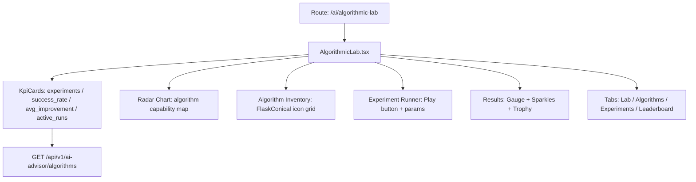

# PRD — Community 398: Algorithmic Lab Dashboard

## Master Goal Mapping
- **Platform Goal**: Experimental AI security algorithms — benchmarking, hypothesis testing, model comparison for security research
- **Persona**: Security Researcher, AI/ML Engineer, Advanced Analyst
- **ALDECI Pillar**: AI Intelligence / Research & Experimentation

## Architecture Diagram


## Code Proof
- **File**: `suite-ui/aldeci-ui-new/src/pages/ai/AlgorithmicLab.tsx:1-80+`
- **Icons**: FlaskConical, Cpu, Play, CheckCircle, Brain, GitBranch, Layers, Target, Atom, Network, Activity, Beaker, Gauge, Sparkles, Trophy
- **Charts**: BarChart + RadarChart from recharts
- **Pattern**: `useEffect` + `useCallback` + `apiClient` + `toArray`
- **Tooltip**: TooltipProvider wrapping algorithm descriptions

## Inter-Dependencies
- **Backend**: `ai_security_advisor_engine.py`, `/api/v1/ai-advisor`
- **Related**: MultiLLM (sibling AI page), SecurityChaos engine
- **Companion**: `researcher` skill from OMC for autonomous experiments

## Data Flow
```
Load algorithms list → inventory grid →
Select algorithm + params → run experiment →
Results: accuracy, improvement %, benchmark comparison →
Leaderboard updates with new result →
Trophy for top-performing algorithm
```

## Acceptance Criteria
- [ ] Algorithm grid with category icons
- [ ] Experiment runner with configurable params
- [ ] Gauge component shows accuracy score
- [ ] Leaderboard sorted by improvement %
- [ ] Radar chart plots multi-metric algorithm profile
- [ ] Tooltip on algorithm name shows description

## Effort Estimate
**L** — 3 days (complete)

## Status
**DONE** — Production AI research page
