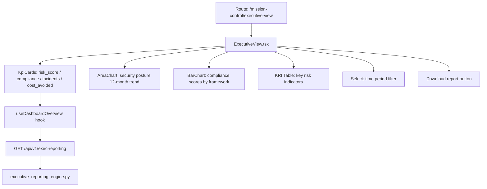

# PRD — Community 399: Executive View Dashboard (aldeci-ui-new)

## Master Goal Mapping
- **Platform Goal**: C-suite security intelligence — KPIs, risk posture trend, compliance scores, cost avoidance, board-ready reporting
- **Persona**: CISO, CTO, CEO, Board Members
- **ALDECI Pillar**: Executive Reporting / Business Risk
- **Backend Engine**: `executive_reporting_engine.py`

## Architecture Diagram


## Code Proof
- **File**: `suite-ui/aldeci-ui-new/src/pages/mission-control/ExecutiveView.tsx:1-80+`
- **Charts**: AreaChart (Area, XAxis, YAxis, CartesianGrid, Tooltip, ResponsiveContainer), BarChart (Bar, Cell, Legend)
- **Icons**: TrendingUp/Down, DollarSign, Shield, CheckCircle2, AlertCircle, Download, Calendar, Award, BarChart3, Building2, Target, Layers, ArrowUpRight/Down, FileText, Clock
- **Components**: Card, Badge, Button, Select, Separator, Progress, Table, PageHeader, KpiCard, PageSkeleton, ErrorState
- **Custom hooks**: `useDashboardOverview`

## Inter-Dependencies
- **Backend**: `executive_reporting_engine.py` — 30+ tests, reports/KPIs/board decks
- **Hooks**: `use-api.ts` hooks (useDashboardOverview)
- **Related**: SecurityKPI tracker, SecurityHealthScorecard, ExecReporting dashboard

## Data Flow
```
useDashboardOverview → GET /api/v1/dashboard/overview →
KPI cards compute trend direction (ArrowUpRight green / ArrowDownRight red) →
AreaChart plots 12-month security score trend →
BarChart renders compliance by framework →
Download button generates PDF/CSV report
```

## Acceptance Criteria
- [ ] 4 executive KPI cards with trend arrows
- [ ] 12-month area chart with gradient fill
- [ ] Compliance bar chart with per-framework scores
- [ ] Time period selector (30d/90d/1y/custom)
- [ ] Download button triggers report export
- [ ] Loading skeleton (PageSkeleton)
- [ ] Error state with retry (ErrorState)

## Effort Estimate
**L** — 3 days (complete)

## Status
**DONE** — Production executive dashboard
