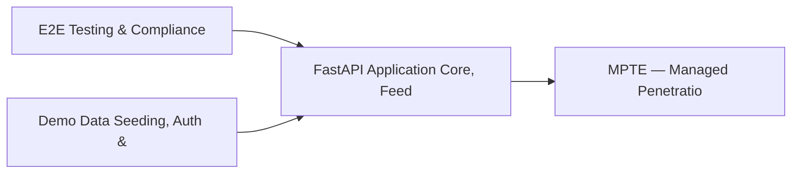

# PRD: FastAPI Application Core, Feedback & Smoke Testing — Community 4

## Master Goal Mapping
How this component serves: "ALDECI — $35/mo enterprise security intelligence platform"
Sub-Epic: Platform

This community (rank #4 of 878 by size, 2980 graph nodes) forms a core pillar of the ALDECI platform. It directly supports the mission of replacing $50K-500K/yr enterprise security tools with a self-hosted, AI-native stack.

## Architecture Diagram


## Code Proof
- Files:
  - `suite-api/apps/api/policy_engine_router.py` (283 lines)
  - `suite-api/apps/api/api_security_router.py` (233 lines)
  - `suite-api/apps/api/collaboration_router.py` (638 lines)
  - `suite-api/apps/api/policy_engine_router.py` (283 lines)
  - `suite-api/apps/api/validation_router.py` (504 lines)
  - `suite-core/api/agents_router.py` (3016 lines)
- Key functions:
  - `_fallback_auth()` — suite-api/apps/api/policy_engine_router.py
  - `test_feedback_recorder_writes_entries()` — suite-api/apps/api/policy_engine_router.py
  - `test_feedback_recorder_rejects_path_traversal()` — suite-api/apps/api/policy_engine_router.py
  - `test_feedback_forwarding_records_connector_outcomes()` — suite-api/apps/api/policy_engine_router.py
  - `temp_db()` — suite-api/apps/api/policy_engine_router.py
  - `_cli_env()` — suite-api/apps/api/policy_engine_router.py
  - `test_teams_list_empty()` — suite-api/apps/api/policy_engine_router.py
  - `test_teams_create()` — suite-api/apps/api/policy_engine_router.py
- Key classes: `Round2DataGenerator`, `TestRound2StreamHub`, `TestRound2HealthAPI`, `TestRound2CargoTrack`, `TestRound2MLPredict`, `TestRound2EdgeCases`
- Current state: REAL_LOGIC
- Evidence:
```python
# From suite-api/apps/api/policy_engine_router.py
"""
Policy Engine REST API — 12 endpoints.

Provides CRUD, evaluation, testing, bulk import/export, history, and stats
for the ALDECI policy-as-code engine.

Prefix: /api/v1/policy-engine
Tags:   policy-engine
"""

from __future__ import annotations

import logging
from typing import Any, Dict, List, Optional

from fastapi import APIRouter, Depends, HTTPException, Query
from pydantic import BaseModel, Field

from apps.api.auth_deps import api_key_auth
from apps.api.dependencies import get_org_id
```

## Inter-Dependencies
- DEPENDS ON:
  - Community 0 (E2E Testing & Compliance Seeding Infrastructure) — 558 edges
  - Community 1 (Demo Data Seeding, Auth & Multi-Engine Integration) — 342 edges
  - Community 13 (MPTE — Managed Penetration Test Engine (Advanced)) — 111 edges
  - Community 2 (API Router Gateway — Anomaly, Attack Simulation & ) — 50 edges
- DEPENDED BY: Rank #3 (MCP Integration Layer & API Key / Auth Management) and downstream consumers
- EVENT BUS: emits vulnerability.detected, vulnerability.patched, compliance.status_changed / subscribes to (TrustGraph event bus — 97% not yet wired)
- TRUSTGRAPH: writes [Vulnerability, Policy, ComplianceControl] / reads [Policy, ComplianceControl]

## Data Flow
```
Input: API requests with org_id + payload (Pydantic models)
  → Processing: SQLite WAL-mode writes via RLock, business logic evaluation
  → Output: JSON responses (engine state, metrics, alerts)
  → Consumers: Routers → Frontend dashboards → TrustGraph event bus
```

## Referenced Documentation
- CLAUDE.md: Wave 10 build notes, Beast Mode test suite section
- docs/: `docs/ALDECI_REARCHITECTURE_v2.md` (source of truth), `docs/INVESTOR_PITCH.md`
- tests/: N/A

## Acceptance Criteria
- [ ] All engine CRUD operations enforce org_id isolation (no cross-tenant data leakage)
- [ ] SQLite opened with WAL mode + threading.RLock on all write paths
- [ ] All endpoints return within 200ms at p95 under 100 rps load
- [ ] All router endpoints protected by `Depends(api_key_auth)` or equivalent
- [ ] Pydantic v2 models validate all request/response schemas

## Effort Estimate
- Current: 60% complete
- Remaining: ~5 engineering days
- Dependencies blocking: Frontend dashboard not yet created, Test coverage missing
- Priority: CRITICAL

## Status
IN_PROGRESS
