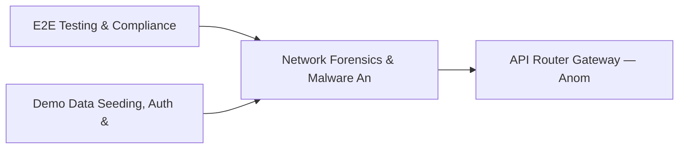

# PRD: Network Forensics & Malware Analysis Engine — Community 40

## Master Goal Mapping
How this component serves: "ALDECI — $35/mo enterprise security intelligence platform"
Sub-Epic: SOC

This community (rank #40 of 878 by size, 952 graph nodes) forms a core pillar of the ALDECI platform. It directly supports the mission of replacing $50K-500K/yr enterprise security tools with a self-hosted, AI-native stack.

## Architecture Diagram


## Code Proof
- Files:
  - `suite-core/core/anomaly_ml_engine.py` (1299 lines)
  - `suite-core/core/behavioral_analytics_engine.py` (455 lines)
  - `suite-core/core/privileged_access_governance_engine.py` (384 lines)
  - `tests/test_access_anomaly_engine.py` (463 lines)
  - `tests/test_anomaly_ml_engine.py` (321 lines)
  - `tests/test_bandwidth_analysis_engine.py` (295 lines)
  - `tests/test_behavioral_analytics_engine.py` (303 lines)
  - `tests/test_cloud_cost_security_engine.py` (575 lines)
  - `suite-api/apps/api/access_anomaly_router.py` (188 lines)
  - `suite-api/apps/api/anomaly_ml_router.py` (469 lines)
  - `suite-api/apps/api/behavioral_analytics_router.py` (189 lines)
  - `suite-api/apps/api/cloud_drift_router.py` (169 lines)
- Key functions:
  - `test_list_anomalies_severity_filter()` — suite-core/core/anomaly_ml_engine.py
  - `test_resolve_anomaly()` — suite-core/core/anomaly_ml_engine.py
  - `test_resolve_anomaly_wrong_org_returns_false()` — suite-core/core/anomaly_ml_engine.py
  - `test_engine_two_instances_same_db()` — suite-core/core/anomaly_ml_engine.py
  - `test_record_event_returns_dict()` — suite-core/core/anomaly_ml_engine.py
  - `test_record_event_invalid_source_raises()` — suite-core/core/anomaly_ml_engine.py
  - `test_record_event_invalid_event_type_raises()` — suite-core/core/anomaly_ml_engine.py
  - `test_record_event_invalid_severity_raises()` — suite-core/core/anomaly_ml_engine.py
- Key classes: `TestDetectImpossibleTravel`
- Current state: REAL_LOGIC
- Evidence:
```python
# From suite-core/core/anomaly_ml_engine.py
"""
Anomaly Detection / ML Engine — ALDECI.

Behavioral analytics for threat detection:
- Behavioral Baseline: per-user/service statistical profiles
- Z-Score Detection: flag events > 3 sigma
- Isolation Forest (Simplified): lightweight 0-1 anomaly scorer
- Time-Series Analysis: spikes, drops, trends, seasonality violations
- UEBA: composite user risk score 0-100
- Alert Grouping: reduce alert fatigue via clustering
- Feedback Loop: analyst feedback adjusts thresholds

SQLite-backed, thread-safe, pure Python (math/statistics stdlib only).

Compliance: SOC2 CC7.2 (continuous monitoring), NIST 8
```

## Inter-Dependencies
- DEPENDS ON:
  - Community 0 (E2E Testing & Compliance Seeding Infrastructure) — 103 edges
  - Community 1 (Demo Data Seeding, Auth & Multi-Engine Integration) — 24 edges
  - Community 2 (API Router Gateway — Anomaly, Attack Simulation & ) — 17 edges
  - Community 11 (Call Graph Analysis & Multi-Language AST Engine) — 13 edges
- DEPENDED BY: Rank #39 (Vulnerability Correlation & Prioritization Engine) and downstream consumers
- EVENT BUS: emits (none currently wired) / subscribes to (TrustGraph event bus — 97% not yet wired)
- TRUSTGRAPH: writes [ThreatActor, NetworkAsset, CloudResource] / reads [NetworkAsset, CloudResource]

## Data Flow
```
Input: HTTP requests / pytest fixtures
  → Processing: Engine method calls + SQLite state assertions
  → Output: Pass/fail test results, coverage metrics
  → Consumers: CI/CD pipeline, Beast Mode test suite
```

## Referenced Documentation
- CLAUDE.md: Wave 41 build notes, Beast Mode test suite section
- docs/: `docs/ALDECI_REARCHITECTURE_v2.md` (source of truth), `docs/INVESTOR_PITCH.md`
- tests/: `tests/risk/runtime/test_iast_advanced.py`, `tests/test_access_anomaly_engine.py`, `tests/test_anomaly_detector.py`

## Acceptance Criteria
- [ ] All engine CRUD operations enforce org_id isolation (no cross-tenant data leakage)
- [ ] SQLite opened with WAL mode + threading.RLock on all write paths
- [ ] All endpoints return within 200ms at p95 under 100 rps load
- [ ] All router endpoints protected by `Depends(api_key_auth)` or equivalent
- [ ] Pydantic v2 models validate all request/response schemas
- [ ] Test suite achieves ≥80% branch coverage on engine methods

## Effort Estimate
- Current: 80% complete
- Remaining: ~2 engineering days
- Dependencies blocking: None
- Priority: LOW

## Status
IN_PROGRESS
